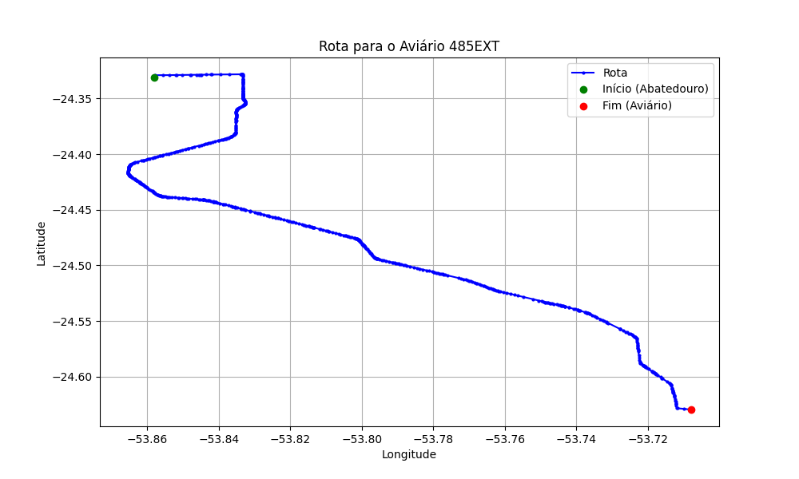

# Relatório de Rota - Aviário 485EXT

## Informações Gerais
- **Produtor:** PLUMA LOURDES BRAGAGNOLLO MORGENSTERN 2
- **Latitude:** -24.630111
- **Longitude:** -53.707722

## Dados da Rota
- **Distância Real:** 43.99 km
- **Tempo Estimado (OSRM):** 40.5 minutos
- **Tempo Estimado (40 km/h):** 66.0 minutos

## Mapa da Rota

[Visualizar Mapa Interativo](mapa_interativo.html)

## Rota até o aviário
1. Saia da rua sem nome, siga por 10m.
2. Vire à direita na Avenida Ariosvaldo Bitencourt, siga por 200m.
3. Siga em frente na Avenida Ariosvaldo Bitencourt, siga por 2,6 km.
4. Vire em frente na Rodovia Alberto Dalcanale, siga por 40,7 km.
5. Vire à esquerda na rua sem nome, siga por 430m.
6. Você chegará ao aviário 485EXT à direita.
