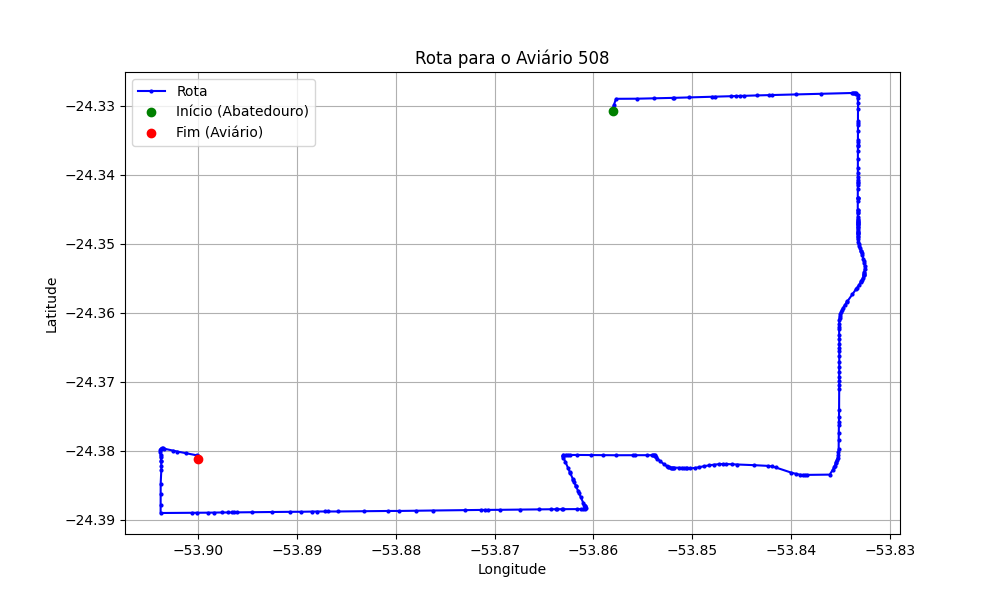

# Relatório de Rota - Aviário 508

## Informações Gerais
- **Produtor:** CELSO ANTONIO LANG
- **Latitude:** -24.381959
- **Longitude:** -53.900251

## Dados da Rota
- **Distância Real:** 18.48 km
- **Tempo Estimado (OSRM):** 25.8 minutos
- **Tempo Estimado (40 km/h):** 27.7 minutos

## Mapa da Rota

[Visualizar Mapa Interativo](mapa_interativo.html)

## Rota até o aviário
1. Saia da rua sem nome, siga por 10m.
2. Vire à direita na Avenida Ariosvaldo Bitencourt, siga por 200m.
3. Siga em frente na Avenida Ariosvaldo Bitencourt, siga por 2,6 km.
4. Vire em frente na Rodovia Alberto Dalcanale, siga por 6,0 km.
5. Vire à direita na rua sem nome, siga por 2,9 km.
6. Vire à esquerda na rua sem nome, siga por 5,3 km.
7. Vire à direita na rua sem nome, siga por 930m.
8. New name em frente na rua sem nome, siga por 500m.
9. Vire à direita na rua sem nome, siga por 60m.
10. Você chegará ao aviário 508.
