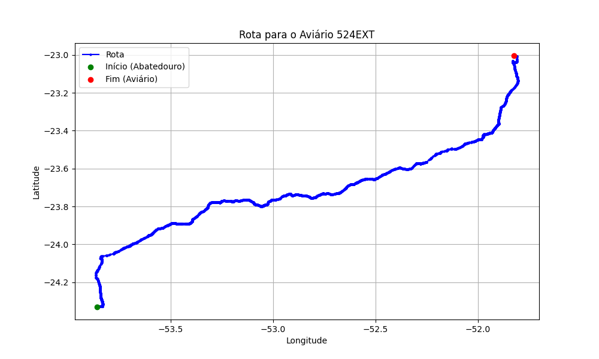

# Relatório de Rota - Aviário 524EXT

## Informações Gerais
- **Produtor:** JAGUA RODOLFO LUIZ FAVERO SCANDELAI
- **Latitude:** -23.0035
- **Longitude:** -51.825639

## Dados da Rota
- **Distância Real:** 316.38 km
- **Tempo Estimado (OSRM):** 261.8 minutos
- **Tempo Estimado (40 km/h):** 474.6 minutos

## Mapa da Rota

[Visualizar Mapa Interativo](mapa_interativo.html)

## Rota até o aviário
1. Saia da rua sem nome, siga por 10m.
2. Vire à direita na Avenida Ariosvaldo Bitencourt, siga por 200m.
3. Siga em frente na Avenida Ariosvaldo Bitencourt, siga por 2,5 km.
4. Vire à esquerda na rua sem nome, siga por 1,5 km.
5. Vire levemente à esquerda na rua sem nome, siga por 660m.
6. Vire em frente na Rodovia Alberto Dalcanale, siga por 1,7 km.
7. New name em frente na Avenida Presidente Kennedy, siga por 7,2 km.
8. Fork levemente à direita na rua sem nome, siga por 20,3 km.
9. Vire à direita na Avenida Brigadeiro Pamplona Pinto, siga por 1,1 km.
10. Siga em frente na rua sem nome, siga por 130m.
11. Siga em frente na rua sem nome, siga por 12,0 km.
12. Vire levemente à direita na rua sem nome, siga por 140m.
13. Siga em frente na rua sem nome, siga por 60m.
14. Siga em frente na rua sem nome, siga por 23,7 km.
15. Vire em frente na rua sem nome, siga por 55,7 km.
16. Rotary em frente na PR-323, siga por 60m.
17. Exit rotary em frente na PR-323, siga por 320m.
18. Siga em frente na rua sem nome, siga por 3,4 km.
19. Siga em frente na rua sem nome, siga por 110m.
20. Fork levemente à esquerda na rua sem nome, siga por 50m.
21. Siga em frente na rua sem nome, siga por 116,7 km.
22. Fork levemente à esquerda na Rodovia Silvino Fernandes Dias, siga por 7,8 km.
23. Siga em frente na Rodovia da Moda, siga por 830m.
24. Rotary em frente na Rodovia da Moda, siga por 60m.
25. Exit rotary em frente na Rodovia da Moda, siga por 1,7 km.
26. Rotary em frente na Avenida Pioneiro João Pereira, siga por 110m.
27. Exit rotary levemente à direita na Avenida Pioneiro João Pereira, siga por 190m.
28. Vire em frente na rua sem nome, siga por 500m.
29. New name em frente na Avenida Colombo, siga por 3,9 km.
30. Vire à esquerda na Avenida Morangueira, siga por 6,4 km.
31. New name em frente na Rodovia Deputado Sílvio Barros, siga por 240m.
32. Vire à esquerda na rua sem nome, siga por 10m.
33. Fork levemente à direita na Rodovia Deputado Sílvio Barros, siga por 20,4 km.
34. Roundabout em frente na Rodovia Deputado Sílvio Barros, siga por 80m.
35. Exit roundabout levemente à direita na Rodovia Deputado Sílvio Barros, siga por 19,4 km.
36. Vire levemente à direita na Avenida Presidente Getúlio Vargas, siga por 2,1 km.
37. Vire à esquerda na Rua Sertanópolis, siga por 330m.
38. End of road à direita na Rua Mato Grosso, siga por 180m.
39. Vire à esquerda na Rua Apucarana, siga por 4,7 km.
40. Você chegará ao aviário 524EXT à esquerda.
