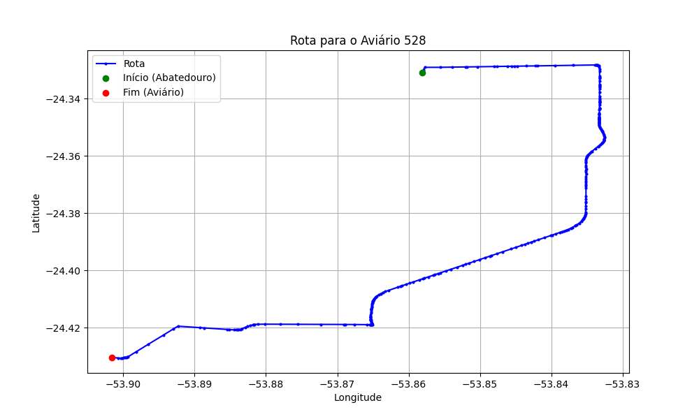

# Relatório de Rota - Aviário 528

## Informações Gerais
- **Produtor:** IVETE DREISSIG KOLLING
- **Latitude:** -24.430567
- **Longitude:** -53.901639

## Dados da Rota
- **Distância Real:** 18.51 km
- **Tempo Estimado (OSRM):** 21.2 minutos
- **Tempo Estimado (40 km/h):** 27.8 minutos

## Mapa da Rota

[Visualizar Mapa Interativo](mapa_interativo.html)

## Rota até o aviário
1. Saia da rua sem nome, siga por 10m.
2. Vire à direita na Avenida Ariosvaldo Bitencourt, siga por 200m.
3. Siga em frente na Avenida Ariosvaldo Bitencourt, siga por 2,6 km.
4. Vire em frente na Rodovia Alberto Dalcanale, siga por 11,1 km.
5. Siga em frente na rua sem nome, siga por 60m.
6. Vire levemente à direita na rua sem nome, siga por 2,0 km.
7. Vire em frente na rua sem nome, siga por 910m.
8. Vire à esquerda na rua sem nome, siga por 1,6 km.
9. Você chegará ao aviário 528 à esquerda.
