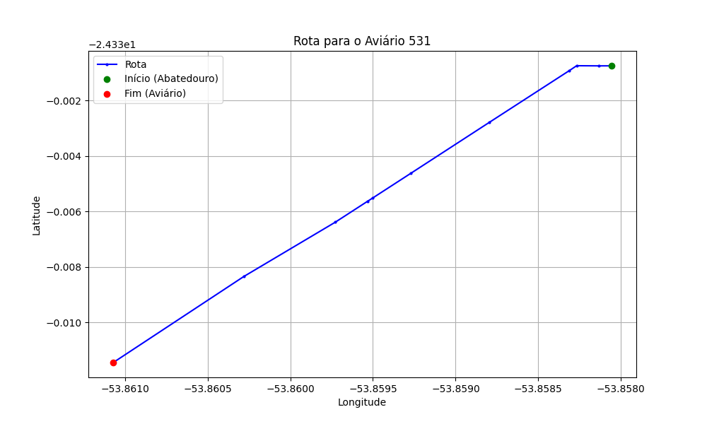

# Relatório de Rota - Aviário 531

## Informações Gerais
- **Produtor:** ALBERTO BENETTI
- **Latitude:** -24.3405
- **Longitude:** -53.865528

## Dados da Rota
- **Distância Real:** 1.24 km
- **Tempo Estimado (OSRM):** 2.0 minutos
- **Tempo Estimado (40 km/h):** 1.9 minutos

## Mapa da Rota

[Visualizar Mapa Interativo](mapa_interativo.html)

## Rota até o aviário
1. Saia da rua sem nome, siga por 10m.
2. Vire à esquerda na Avenida Ariosvaldo Bitencourt, siga por 1,2 km.
3. Você chegará ao aviário 531.
