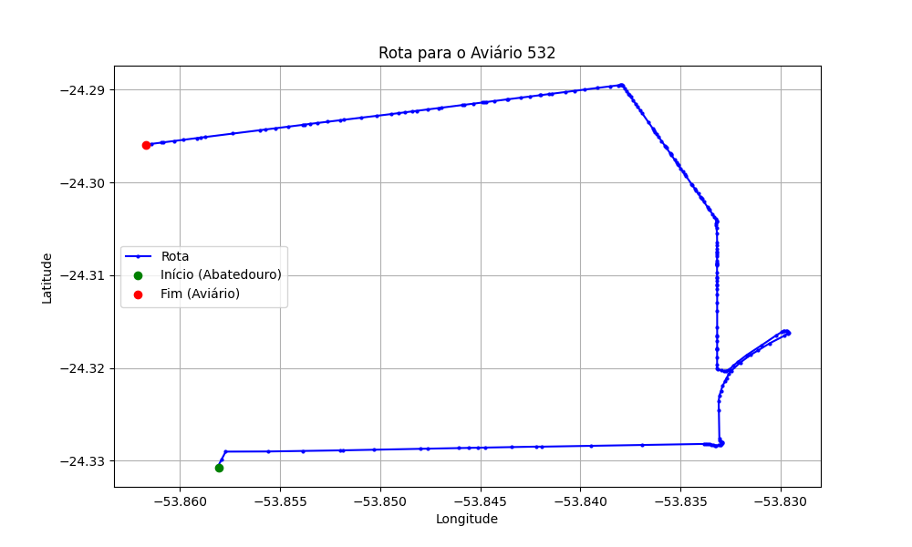

# Relatório de Rota - Aviário 532

## Informações Gerais
- **Produtor:** CARLOS LUIZ WILLRICH
- **Latitude:** -24.293194
- **Longitude:** -53.862556

## Dados da Rota
- **Distância Real:** 10.78 km
- **Tempo Estimado (OSRM):** 15.9 minutos
- **Tempo Estimado (40 km/h):** 16.2 minutos

## Mapa da Rota

[Visualizar Mapa Interativo](mapa_interativo.html)

## Rota até o aviário
1. Saia da rua sem nome, siga por 10m.
2. Vire à direita na Avenida Ariosvaldo Bitencourt, siga por 200m.
3. Siga em frente na Avenida Ariosvaldo Bitencourt, siga por 2,5 km.
4. Vire à esquerda na rua sem nome, siga por 1,5 km.
5. Vire levemente à esquerda na rua sem nome, siga por 660m.
6. Vire em frente na Rodovia Alberto Dalcanale, siga por 1,7 km.
7. New name em frente na Avenida Presidente Kennedy, siga por 1,7 km.
8. Vire à esquerda na Rua 24 de Junho, siga por 1,6 km.
9. New name em frente na Estrada Municipal Orestes Viletti, siga por 900m.
10. Você chegará ao aviário 532.
