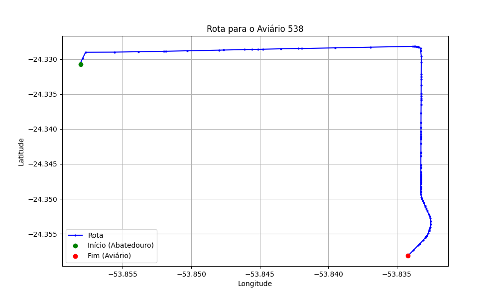

# Relatório de Rota - Aviário 538

## Informações Gerais
- **Produtor:** IVETE PASCOA BORTOLOZZO BATTISTI
- **Latitude:** -24.357511
- **Longitude:** -53.835638

## Dados da Rota
- **Distância Real:** 6.03 km
- **Tempo Estimado (OSRM):** 7.8 minutos
- **Tempo Estimado (40 km/h):** 9.0 minutos

## Mapa da Rota

[Visualizar Mapa Interativo](mapa_interativo.html)

## Rota até o aviário
1. Saia da rua sem nome, siga por 10m.
2. Vire à direita na Avenida Ariosvaldo Bitencourt, siga por 200m.
3. Siga em frente na Avenida Ariosvaldo Bitencourt, siga por 2,6 km.
4. Vire em frente na Rodovia Alberto Dalcanale, siga por 3,2 km.
5. Você chegará ao aviário 538 à direita.
