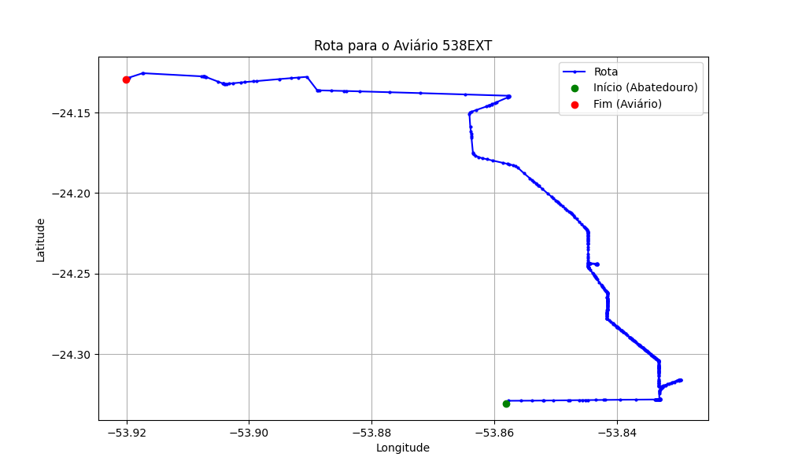

# Relatório de Rota - Aviário 538EXT

## Informações Gerais
- **Produtor:** PLUMA ADEMIR LUIZ CHIUMENTO 01
- **Latitude:** -24.144065
- **Longitude:** -53.934196

## Dados da Rota
- **Distância Real:** 33.58 km
- **Tempo Estimado (OSRM):** 43.7 minutos
- **Tempo Estimado (40 km/h):** 50.4 minutos

## Mapa da Rota

[Visualizar Mapa Interativo](mapa_interativo.html)

## Rota até o aviário
1. Saia da rua sem nome, siga por 10m.
2. Vire à direita na Avenida Ariosvaldo Bitencourt, siga por 200m.
3. Siga em frente na Avenida Ariosvaldo Bitencourt, siga por 2,5 km.
4. Vire à esquerda na rua sem nome, siga por 1,5 km.
5. Vire levemente à esquerda na rua sem nome, siga por 660m.
6. Vire em frente na Rodovia Alberto Dalcanale, siga por 1,7 km.
7. New name em frente na Avenida Presidente Kennedy, siga por 7,2 km.
8. Fork levemente à direita na rua sem nome, siga por 12,1 km.
9. Vire à esquerda na Avenida Florianópolis, siga por 740m.
10. New name em frente na Estrada Xuxa, siga por 3,4 km.
11. Vire à esquerda na rua sem nome, siga por 1,4 km.
12. Fork levemente à direita na rua sem nome, siga por 1,7 km.
13. Vire à esquerda na rua sem nome, siga por 500m.
14. Você chegará ao aviário 538EXT.
