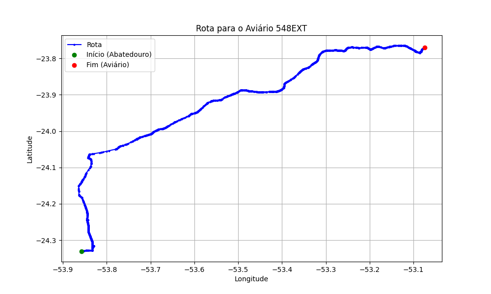

# Relatório de Rota - Aviário 548EXT

## Informações Gerais
- **Produtor:** PLUMA MOACIR FUGIMOTO
- **Latitude:** -23.769639
- **Longitude:** -53.074611

## Dados da Rota
- **Distância Real:** 128.31 km
- **Tempo Estimado (OSRM):** 112.6 minutos
- **Tempo Estimado (40 km/h):** 192.5 minutos

## Mapa da Rota

[Visualizar Mapa Interativo](mapa_interativo.html)

## Rota até o aviário
1. Saia da rua sem nome, siga por 10m.
2. Vire à direita na Avenida Ariosvaldo Bitencourt, siga por 200m.
3. Siga em frente na Avenida Ariosvaldo Bitencourt, siga por 2,5 km.
4. Vire à esquerda na rua sem nome, siga por 1,5 km.
5. Vire levemente à esquerda na rua sem nome, siga por 660m.
6. Vire em frente na Rodovia Alberto Dalcanale, siga por 1,7 km.
7. New name em frente na Avenida Presidente Kennedy, siga por 7,2 km.
8. Fork levemente à direita na rua sem nome, siga por 20,3 km.
9. Vire à direita na Avenida Brigadeiro Pamplona Pinto, siga por 1,1 km.
10. Siga em frente na rua sem nome, siga por 130m.
11. Siga em frente na rua sem nome, siga por 12,0 km.
12. Vire levemente à direita na rua sem nome, siga por 140m.
13. Siga em frente na rua sem nome, siga por 60m.
14. Siga em frente na rua sem nome, siga por 23,7 km.
15. Vire em frente na rua sem nome, siga por 53,8 km.
16. Off ramp em frente na Entroncamento PR-323 com Avenida, siga por 140m.
17. Vire à esquerda na Avenida Goiás, siga por 990m.
18. Vire à esquerda na Avenida Alagoas, siga por 540m.
19. End of road à direita na Avenida Brasil, siga por 30m.
20. Roundabout à direita na Avenida Santos Dumont, siga por 60m.
21. Exit roundabout à direita na Avenida Santos Dumont, siga por 80m.
22. Vire à esquerda na Rua Tuneiras, siga por 310m.
23. New name em frente na Rua João Gomes Luiz, siga por 160m.
24. End of road à direita na Rua Professor João da Luz da Silva Correia, siga por 90m.
25. Vire à esquerda na Rua Doutor Jonas Rauen, siga por 140m.
26. New name levemente à direita na Rua Guaraqueçaba, siga por 810m.
27. Vire levemente à esquerda na rua sem nome, siga por 90m.
28. Você chegará ao aviário 548EXT à esquerda.
