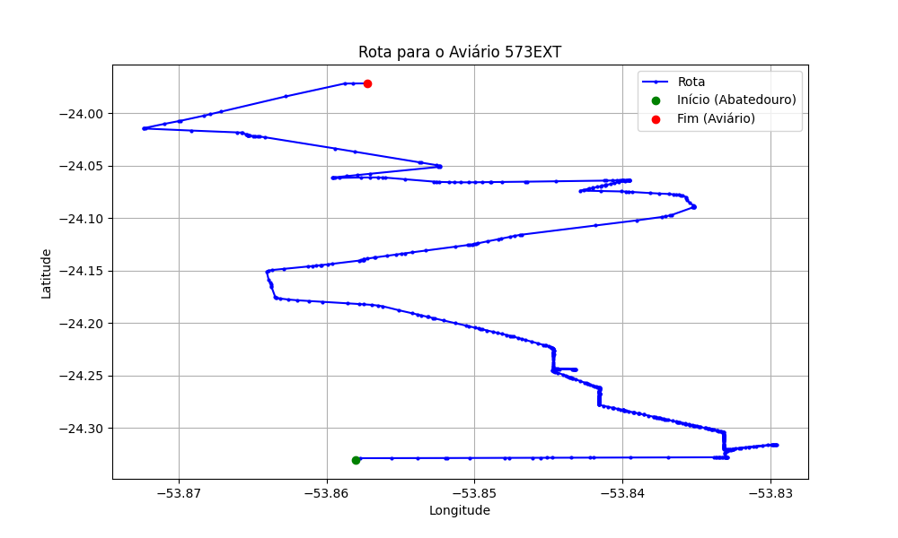

# Relatório de Rota - Aviário 573EXT

## Informações Gerais
- **Produtor:** PLUSVAL ADRIANO VIEIRA DOS SANTOS 1
- **Latitude:** -23.970722
- **Longitude:** -53.857306

## Dados da Rota
- **Distância Real:** 48.65 km
- **Tempo Estimado (OSRM):** 54.8 minutos
- **Tempo Estimado (40 km/h):** 73.0 minutos

## Mapa da Rota

[Visualizar Mapa Interativo](mapa_interativo.html)

## Rota até o aviário
1. Saia da rua sem nome, siga por 10m.
2. Vire à direita na Avenida Ariosvaldo Bitencourt, siga por 200m.
3. Siga em frente na Avenida Ariosvaldo Bitencourt, siga por 2,5 km.
4. Vire à esquerda na rua sem nome, siga por 1,5 km.
5. Vire levemente à esquerda na rua sem nome, siga por 660m.
6. Vire em frente na Rodovia Alberto Dalcanale, siga por 1,7 km.
7. New name em frente na Avenida Presidente Kennedy, siga por 7,2 km.
8. Fork levemente à direita na rua sem nome, siga por 20,3 km.
9. Vire à direita na Avenida Brigadeiro Pamplona Pinto, siga por 1,2 km.
10. Siga em frente na rua sem nome, siga por 130m.
11. Siga em frente na rua sem nome, siga por 1,0 km.
12. Vire em frente na rua sem nome, siga por 12,1 km.
13. End of road à direita na Estrada Nilza, siga por 160m.
14. Você chegará ao aviário 573EXT à esquerda.
