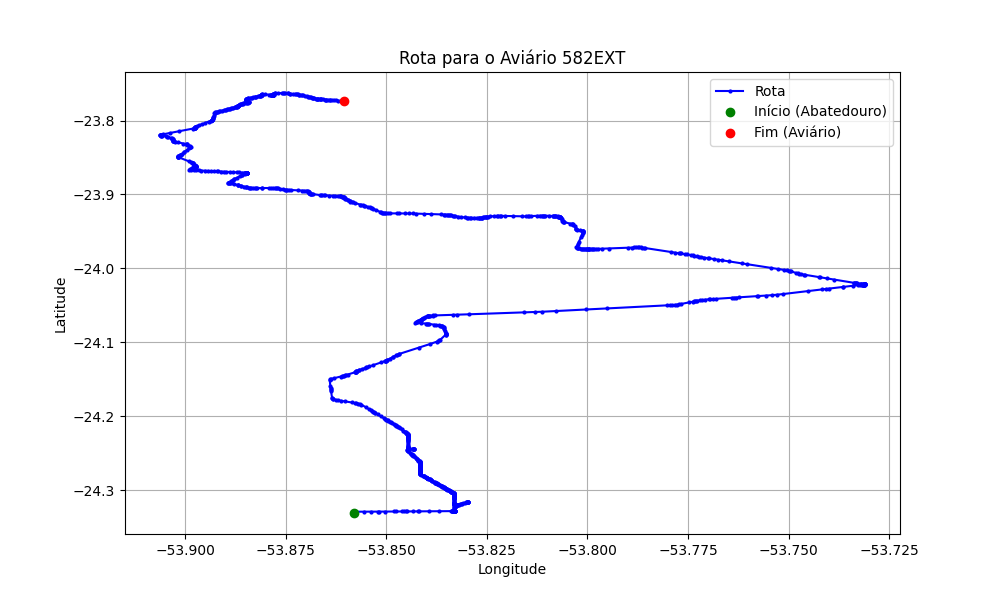

# Relatório de Rota - Aviário 582EXT

## Informações Gerais
- **Produtor:** PLUMA ODAIR BASTOS DE SOUZA 2
- **Latitude:** -23.772917
- **Longitude:** -53.859972

## Dados da Rota
- **Distância Real:** 91.62 km
- **Tempo Estimado (OSRM):** 89.2 minutos
- **Tempo Estimado (40 km/h):** 137.4 minutos

## Mapa da Rota

[Visualizar Mapa Interativo](mapa_interativo.html)

## Rota até o aviário
1. Saia da rua sem nome, siga por 10m.
2. Vire à direita na Avenida Ariosvaldo Bitencourt, siga por 200m.
3. Siga em frente na Avenida Ariosvaldo Bitencourt, siga por 2,5 km.
4. Vire à esquerda na rua sem nome, siga por 1,5 km.
5. Vire levemente à esquerda na rua sem nome, siga por 660m.
6. Vire em frente na Rodovia Alberto Dalcanale, siga por 1,7 km.
7. New name em frente na Avenida Presidente Kennedy, siga por 7,2 km.
8. Fork levemente à direita na rua sem nome, siga por 20,3 km.
9. Vire à direita na Avenida Brigadeiro Pamplona Pinto, siga por 1,1 km.
10. Siga em frente na rua sem nome, siga por 130m.
11. Siga em frente na rua sem nome, siga por 12,0 km.
12. Vire levemente à direita na rua sem nome, siga por 190m.
13. Fork levemente à direita na rua sem nome, siga por 70m.
14. New name em frente na rua sem nome, siga por 25,8 km.
15. Vire à direita na Rua Marechal Arthur da Costa e Silva, siga por 1,4 km.
16. Vire levemente à direita na Avenida Brasil, siga por 70m.
17. Roundabout em frente na Avenida dos Agricultores, siga por 60m.
18. Exit roundabout em frente na Avenida dos Agricultores, siga por 1,5 km.
19. Vire à direita na Ruia Elgidio Resende, siga por 560m.
20. New name em frente na Estrada Alhambra (PR-490), siga por 5,0 km.
21. Siga em frente na Estrada Alhambra (PR-490), siga por 3,0 km.
22. New name em frente na PR-490, siga por 3,8 km.
23. New name em frente na Rua Marechal Cândido Rondon, siga por 150m.
24. Vire à direita na Avenida Presidente Castelo Branco, siga por 220m.
25. Rotary à direita na Avenida Presidente Getúlio Vargas, siga por 130m.
26. Exit rotary à direita na Avenida Presidente Getúlio Vargas, siga por 220m.
27. Vire à direita na Rua Marechal Floriano Peixoto, siga por 540m.
28. New name em frente na Estrada São Henrique, siga por 1,7 km.
29. Você chegará ao aviário 582EXT à esquerda.
