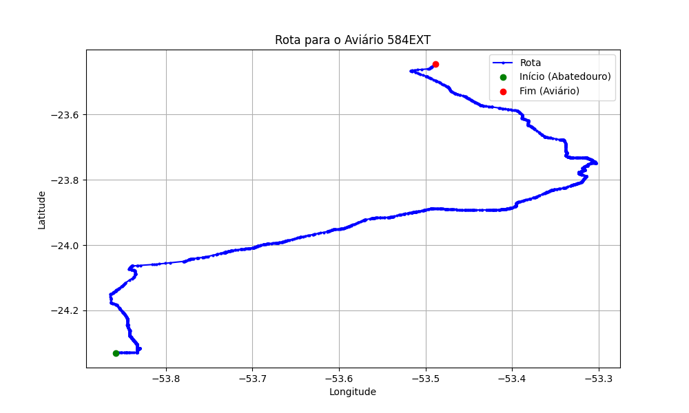

# Relatório de Rota - Aviário 584EXT

## Informações Gerais
- **Produtor:** PLUSVAL MARCOS AGUERA LOPES
- **Latitude:** -23.4414
- **Longitude:** -53.48196

## Dados da Rota
- **Distância Real:** 152.67 km
- **Tempo Estimado (OSRM):** 161.9 minutos
- **Tempo Estimado (40 km/h):** 229.0 minutos

## Mapa da Rota

[Visualizar Mapa Interativo](mapa_interativo.html)

## Rota até o aviário
1. Saia da rua sem nome, siga por 10m.
2. Vire à direita na Avenida Ariosvaldo Bitencourt, siga por 200m.
3. Siga em frente na Avenida Ariosvaldo Bitencourt, siga por 2,5 km.
4. Vire à esquerda na rua sem nome, siga por 1,5 km.
5. Vire levemente à esquerda na rua sem nome, siga por 660m.
6. Vire em frente na Rodovia Alberto Dalcanale, siga por 1,7 km.
7. New name em frente na Avenida Presidente Kennedy, siga por 7,2 km.
8. Fork levemente à direita na rua sem nome, siga por 20,3 km.
9. Vire à direita na Avenida Brigadeiro Pamplona Pinto, siga por 1,1 km.
10. Siga em frente na rua sem nome, siga por 130m.
11. Siga em frente na rua sem nome, siga por 12,0 km.
12. Vire levemente à direita na rua sem nome, siga por 140m.
13. Siga em frente na rua sem nome, siga por 60m.
14. Siga em frente na rua sem nome, siga por 23,7 km.
15. Vire em frente na rua sem nome, siga por 28,7 km.
16. Off ramp levemente à direita na rua sem nome, siga por 110m.
17. Vire em frente na Rua Manoel Ramirez, siga por 540m.
18. Vire levemente à direita na rua sem nome, siga por 90m.
19. Vire à direita na Avenida Doutor Ângelo Moreira da Fonseca, siga por 1,3 km.
20. Vire levemente à direita na Avenida Guanabara, siga por 420m.
21. Roundabout levemente à direita na Avenida Brasil, siga por 20m.
22. Exit roundabout à direita na Avenida Brasil, siga por 200m.
23. Rotary à direita na Avenida Brasil, siga por 120m.
24. Exit rotary à direita na Avenida Brasil, siga por 600m.
25. Rotary à direita na Avenida Celso Garcia Cid, siga por 240m.
26. Exit rotary à direita na Avenida Celso Garcia Cid, siga por 620m.
27. Vire à direita na Avenida Ângelo Moreira da Fonseca, siga por 420m.
28. Vire à esquerda na Avenida Doutor Ângelo Moreira da Fonseca, siga por 710m.
29. Vire à esquerda na Avenida Anhanguera, siga por 440m.
30. End of road à direita na Praça Anchieta, siga por 30m.
31. Vire à esquerda na Praça Anchieta, siga por 60m.
32. New name em frente na Avenida Rio Grande do Norte, siga por 1,1 km.
33. Vire à esquerda na Avenida Guarani, siga por 40m.
34. Roundabout em frente na Avenida Pirapó, siga por 70m.
35. Exit roundabout à direita na Avenida Pirapó, siga por 80m.
36. New name em frente na PR-580, siga por 4,6 km.
37. Fork levemente à direita na rua sem nome, siga por 13,8 km.
38. New name em frente na Avenida Central, siga por 3,9 km.
39. Vire à esquerda na Estrada Boiadeira, siga por 8,1 km.
40. New name em frente na rua sem nome, siga por 11,1 km.
41. Vire à direita na rua sem nome, siga por 600m.
42. Vire em frente na rua sem nome, siga por 1,7 km.
43. Vire à esquerda na rua sem nome, siga por 1,8 km.
44. Você chegará ao aviário 584EXT.
