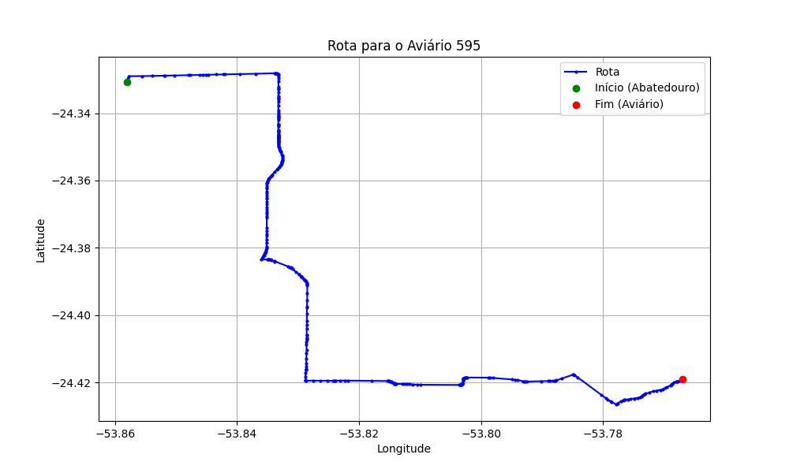

# Relatório de Rota - Aviário 595

## Informações Gerais
- **Produtor:** MAURICIO JAIR LEITZKE
- **Latitude:** -24.419253
- **Longitude:** -53.766833

## Dados da Rota
- **Distância Real:** 20.63 km
- **Tempo Estimado (OSRM):** 29.0 minutos
- **Tempo Estimado (40 km/h):** 30.9 minutos

## Mapa da Rota

[Visualizar Mapa Interativo](mapa_interativo.html)

## Rota até o aviário
1. Saia da rua sem nome, siga por 10m.
2. Vire à direita na Avenida Ariosvaldo Bitencourt, siga por 200m.
3. Siga em frente na Avenida Ariosvaldo Bitencourt, siga por 2,6 km.
4. Vire em frente na Rodovia Alberto Dalcanale, siga por 6,0 km.
5. Vire à esquerda na rua sem nome, siga por 3,8 km.
6. New name em frente na Avenida General Canabarro, siga por 550m.
7. Vire à esquerda na Avenida Farrapos, siga por 720m.
8. New name em frente na rua sem nome, siga por 4,1 km.
9. Vire à direita na rua sem nome, siga por 1,2 km.
10. Vire à esquerda na rua sem nome, siga por 1,4 km.
11. Você chegará ao aviário 595 à direita.
