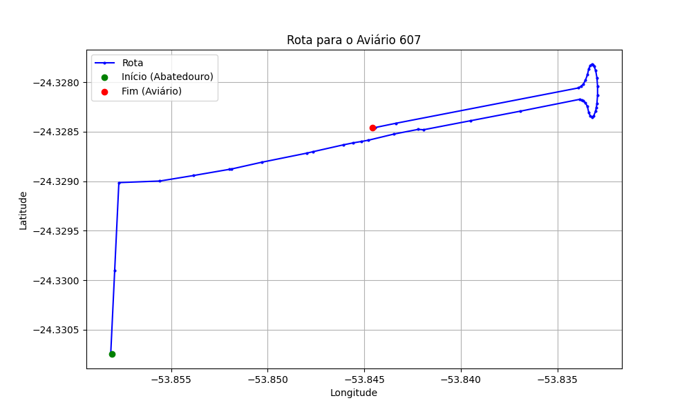

# Relatório de Rota - Aviário 607

## Informações Gerais
- **Produtor:** ANDREI BENETTI
- **Latitude:** -24.321222
- **Longitude:** -53.844833

## Dados da Rota
- **Distância Real:** 3.95 km
- **Tempo Estimado (OSRM):** 14.6 minutos
- **Tempo Estimado (40 km/h):** 5.9 minutos

## Mapa da Rota

[Visualizar Mapa Interativo](mapa_interativo.html)

## Rota até o aviário
1. Saia da rua sem nome, siga por 10m.
2. Vire à direita na Avenida Ariosvaldo Bitencourt, siga por 200m.
3. Siga em frente na Avenida Ariosvaldo Bitencourt, siga por 2,5 km.
4. Vire à esquerda na rua sem nome, siga por 90m.
5. Vire acentuadamente à esquerda na rua sem nome, siga por 50m.
6. Fork levemente à direita na rua sem nome, siga por 50m.
7. New name em frente na Avenida Ariosvaldo Bitencourt, siga por 1,1 km.
8. Você chegará ao aviário 607.
