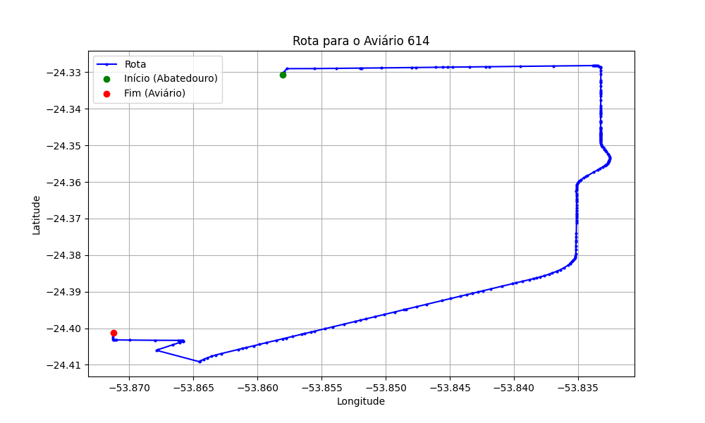

# Relatório de Rota - Aviário 614

## Informações Gerais
- **Produtor:** DIVO ROMEU LUDEWIG
- **Latitude:** -24.401306
- **Longitude:** -53.8715

## Dados da Rota
- **Distância Real:** 14.54 km
- **Tempo Estimado (OSRM):** 17.3 minutos
- **Tempo Estimado (40 km/h):** 21.8 minutos

## Mapa da Rota

[Visualizar Mapa Interativo](mapa_interativo.html)

## Rota até o aviário
1. Saia da rua sem nome, siga por 10m.
2. Vire à direita na Avenida Ariosvaldo Bitencourt, siga por 200m.
3. Siga em frente na Avenida Ariosvaldo Bitencourt, siga por 2,6 km.
4. Vire em frente na Rodovia Alberto Dalcanale, siga por 10,1 km.
5. Vire à direita na rua sem nome, siga por 480m.
6. Vire à direita na rua sem nome, siga por 910m.
7. Vire à direita na rua sem nome, siga por 210m.
8. Você chegará ao aviário 614 à esquerda.
