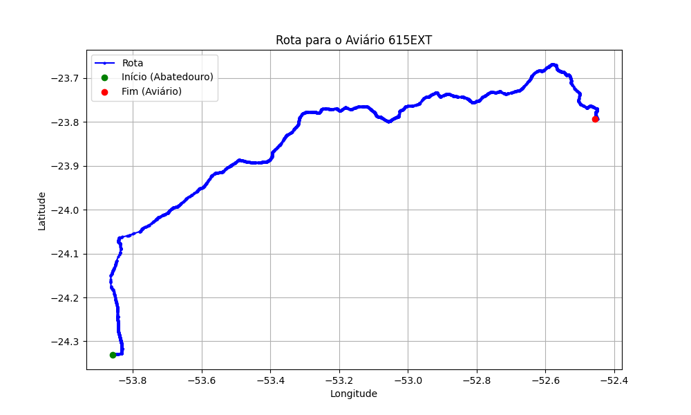

# Relatório de Rota - Aviário 615EXT

## Informações Gerais
- **Produtor:** COROAVES VALDIR SIDNEY POLLI 5
- **Latitude:** -23.793056
- **Longitude:** -52.456056

## Dados da Rota
- **Distância Real:** 209.75 km
- **Tempo Estimado (OSRM):** 179.0 minutos
- **Tempo Estimado (40 km/h):** 314.6 minutos

## Mapa da Rota

[Visualizar Mapa Interativo](mapa_interativo.html)

## Rota até o aviário
1. Saia da rua sem nome, siga por 10m.
2. Vire à direita na Avenida Ariosvaldo Bitencourt, siga por 200m.
3. Siga em frente na Avenida Ariosvaldo Bitencourt, siga por 2,5 km.
4. Vire à esquerda na rua sem nome, siga por 1,5 km.
5. Vire levemente à esquerda na rua sem nome, siga por 660m.
6. Vire em frente na Rodovia Alberto Dalcanale, siga por 1,7 km.
7. New name em frente na Avenida Presidente Kennedy, siga por 7,2 km.
8. Fork levemente à direita na rua sem nome, siga por 20,3 km.
9. Vire à direita na Avenida Brigadeiro Pamplona Pinto, siga por 1,1 km.
10. Siga em frente na rua sem nome, siga por 130m.
11. Siga em frente na rua sem nome, siga por 12,0 km.
12. Vire levemente à direita na rua sem nome, siga por 140m.
13. Siga em frente na rua sem nome, siga por 60m.
14. Siga em frente na rua sem nome, siga por 23,7 km.
15. Vire em frente na rua sem nome, siga por 55,7 km.
16. Rotary em frente na PR-323, siga por 60m.
17. Exit rotary em frente na PR-323, siga por 320m.
18. Siga em frente na rua sem nome, siga por 3,4 km.
19. Siga em frente na rua sem nome, siga por 110m.
20. Fork levemente à esquerda na rua sem nome, siga por 50m.
21. Siga em frente na rua sem nome, siga por 54,3 km.
22. Off ramp levemente à direita na rua sem nome, siga por 350m.
23. Vire levemente à direita na Avenida Paraíba, siga por 40m.
24. Roundabout levemente à direita na Avenida Paraíba, siga por 20m.
25. Exit roundabout em frente na Avenida Paraíba, siga por 80m.
26. New name em frente na rua sem nome, siga por 19,1 km.
27. Vire em frente na rua sem nome, siga por 60m.
28. Rotary em frente na rua sem nome, siga por 10m.
29. Exit rotary em frente na rua sem nome, siga por 50m.
30. New name em frente na Avenida Napoleão Moreira da Silva, siga por 420m.
31. Siga em frente na Avenida Napoleão Moreira da Silva, siga por 930m.
32. Rotary à direita na Avenida Melvin Jones, siga por 90m.
33. Exit rotary à direita na Avenida Melvin Jones, siga por 1,7 km.
34. Vire à esquerda na Avenida Melvin Jones, siga por 1,2 km.
35. End of road à direita na Estrada Andico, siga por 10m.
36. Vire à direita na Estrada Passaúna, siga por 510m.
37. Vire à esquerda na rua sem nome, siga por 220m.
38. Você chegará ao aviário 615EXT à direita.
