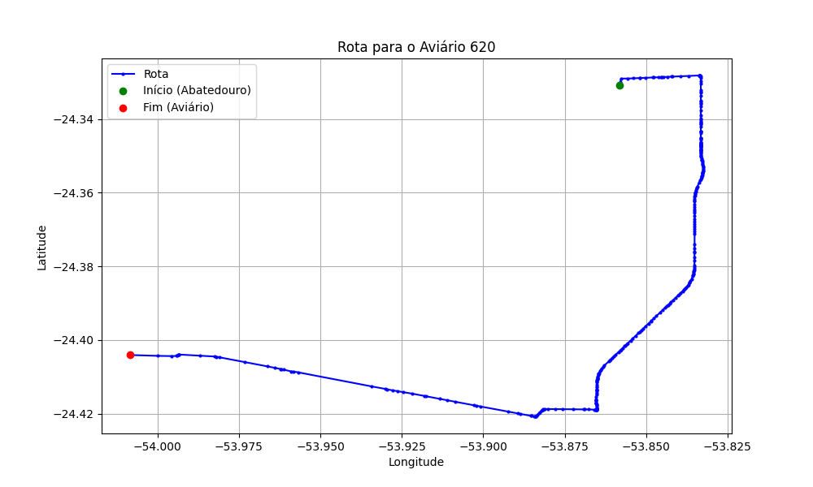

# Relatório de Rota - Aviário 620

## Informações Gerais
- **Produtor:** NELSON TIETZ
- **Latitude:** -24.403583
- **Longitude:** -54.008333

## Dados da Rota
- **Distância Real:** 28.80 km
- **Tempo Estimado (OSRM):** 28.4 minutos
- **Tempo Estimado (40 km/h):** 43.2 minutos

## Mapa da Rota

[Visualizar Mapa Interativo](mapa_interativo.html)

## Rota até o aviário
1. Saia da rua sem nome, siga por 10m.
2. Vire à direita na Avenida Ariosvaldo Bitencourt, siga por 200m.
3. Siga em frente na Avenida Ariosvaldo Bitencourt, siga por 2,6 km.
4. Vire em frente na Rodovia Alberto Dalcanale, siga por 11,1 km.
5. Siga em frente na rua sem nome, siga por 60m.
6. Vire levemente à direita na rua sem nome, siga por 2,0 km.
7. Vire em frente na rua sem nome, siga por 1,8 km.
8. Vire em frente na rua sem nome, siga por 9,8 km.
9. Vire em frente na Estrada para Planalto do Oeste, siga por 1,3 km.
10. Você chegará ao aviário 620 à direita.
