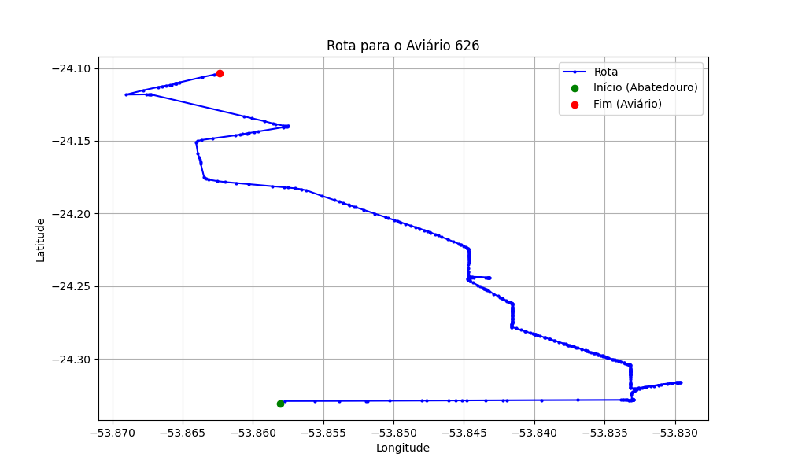

# Relatório de Rota - Aviário 626

## Informações Gerais
- **Produtor:** VILAMIR JOSE TUSSI
- **Latitude:** -24.103611
- **Longitude:** -53.861638

## Dados da Rota
- **Distância Real:** 30.38 km
- **Tempo Estimado (OSRM):** 39.7 minutos
- **Tempo Estimado (40 km/h):** 45.6 minutos

## Mapa da Rota

[Visualizar Mapa Interativo](mapa_interativo.html)

## Rota até o aviário
1. Saia da rua sem nome, siga por 10m.
2. Vire à direita na Avenida Ariosvaldo Bitencourt, siga por 200m.
3. Siga em frente na Avenida Ariosvaldo Bitencourt, siga por 2,5 km.
4. Vire à esquerda na rua sem nome, siga por 1,5 km.
5. Vire levemente à esquerda na rua sem nome, siga por 660m.
6. Vire em frente na Rodovia Alberto Dalcanale, siga por 1,7 km.
7. New name em frente na Avenida Presidente Kennedy, siga por 7,2 km.
8. Fork levemente à direita na rua sem nome, siga por 12,1 km.
9. Vire à esquerda na Estrada Lupionópolis, siga por 2,8 km.
10. Vire à direita na rua sem nome, siga por 1,8 km.
11. Você chegará ao aviário 626 à direita.
