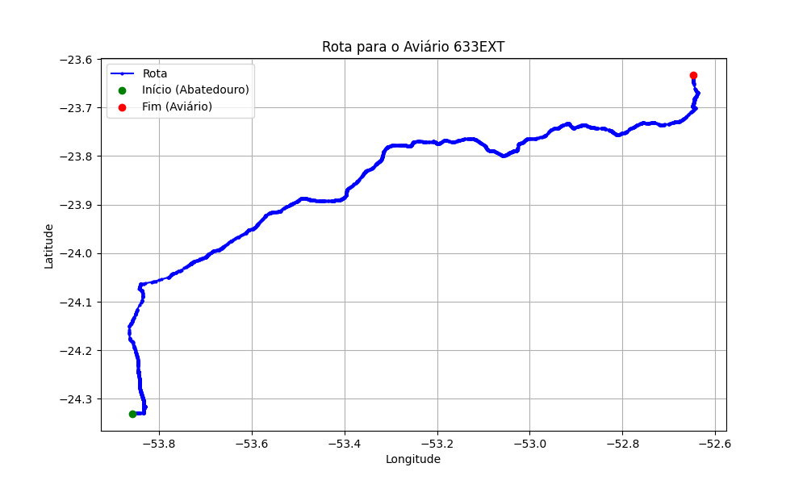

# Relatório de Rota - Aviário 633EXT

## Informações Gerais
- **Produtor:** SOMAVE MARGARIDA BOTTER AV01
- **Latitude:** -23.633167
- **Longitude:** -52.644762

## Dados da Rota
- **Distância Real:** 186.22 km
- **Tempo Estimado (OSRM):** 155.0 minutos
- **Tempo Estimado (40 km/h):** 279.3 minutos

## Mapa da Rota

[Visualizar Mapa Interativo](mapa_interativo.html)

## Rota até o aviário
1. Saia da rua sem nome, siga por 10m.
2. Vire à direita na Avenida Ariosvaldo Bitencourt, siga por 200m.
3. Siga em frente na Avenida Ariosvaldo Bitencourt, siga por 2,5 km.
4. Vire à esquerda na rua sem nome, siga por 1,5 km.
5. Vire levemente à esquerda na rua sem nome, siga por 660m.
6. Vire em frente na Rodovia Alberto Dalcanale, siga por 1,7 km.
7. New name em frente na Avenida Presidente Kennedy, siga por 7,2 km.
8. Fork levemente à direita na rua sem nome, siga por 20,3 km.
9. Vire à direita na Avenida Brigadeiro Pamplona Pinto, siga por 1,1 km.
10. Siga em frente na rua sem nome, siga por 130m.
11. Siga em frente na rua sem nome, siga por 12,0 km.
12. Vire levemente à direita na rua sem nome, siga por 140m.
13. Siga em frente na rua sem nome, siga por 60m.
14. Siga em frente na rua sem nome, siga por 23,7 km.
15. Vire em frente na rua sem nome, siga por 55,7 km.
16. Rotary em frente na PR-323, siga por 60m.
17. Exit rotary em frente na PR-323, siga por 320m.
18. Siga em frente na rua sem nome, siga por 3,4 km.
19. Siga em frente na rua sem nome, siga por 110m.
20. Fork levemente à esquerda na rua sem nome, siga por 50m.
21. Siga em frente na rua sem nome, siga por 47,0 km.
22. Off ramp levemente à direita na rua sem nome, siga por 150m.
23. Vire levemente à direita na rua sem nome, siga por 730m.
24. New name em frente na Avenida Santos Dumont, siga por 3,2 km.
25. End of road à direita na Largo Gastão Vidigal, siga por 50m.
26. Vire à esquerda na Largo Gastão Vidigal, siga por 110m.
27. Vire à direita na Avenida Europa, siga por 170m.
28. New name em frente na Estrada dos Amores, siga por 4,1 km.
29. Você chegará ao aviário 633EXT à direita.
