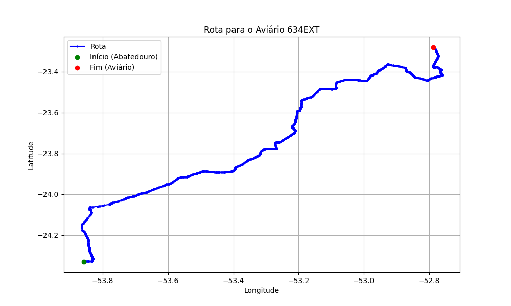

# Relatório de Rota - Aviário 634EXT

## Informações Gerais
- **Produtor:** SOMAVE JOAO VITOR BARRANCO AV01
- **Latitude:** -23.280853
- **Longitude:** -52.788446

## Dados da Rota
- **Distância Real:** 215.58 km
- **Tempo Estimado (OSRM):** 199.4 minutos
- **Tempo Estimado (40 km/h):** 323.4 minutos

## Mapa da Rota

[Visualizar Mapa Interativo](mapa_interativo.html)

## Rota até o aviário
1. Saia da rua sem nome, siga por 10m.
2. Vire à direita na Avenida Ariosvaldo Bitencourt, siga por 200m.
3. Siga em frente na Avenida Ariosvaldo Bitencourt, siga por 2,5 km.
4. Vire à esquerda na rua sem nome, siga por 1,5 km.
5. Vire levemente à esquerda na rua sem nome, siga por 660m.
6. Vire em frente na Rodovia Alberto Dalcanale, siga por 1,7 km.
7. New name em frente na Avenida Presidente Kennedy, siga por 7,2 km.
8. Fork levemente à direita na rua sem nome, siga por 20,3 km.
9. Vire à direita na Avenida Brigadeiro Pamplona Pinto, siga por 1,1 km.
10. Siga em frente na rua sem nome, siga por 130m.
11. Siga em frente na rua sem nome, siga por 12,0 km.
12. Vire levemente à direita na rua sem nome, siga por 140m.
13. Siga em frente na rua sem nome, siga por 60m.
14. Siga em frente na rua sem nome, siga por 23,7 km.
15. Vire em frente na rua sem nome, siga por 34,5 km.
16. Vire à esquerda na rua sem nome, siga por 3,4 km.
17. Roundabout em frente na Rodovia Moacyr Loures Pacheco, siga por 10m.
18. Exit roundabout em frente na Rodovia Moacyr Loures Pacheco, siga por 17,0 km.
19. New name em frente na Avenida Paraná, siga por 1,7 km.
20. Rotary à direita na Avenida Paraná, siga por 130m.
21. Exit rotary à direita na Avenida Paraná, siga por 490m.
22. New name em frente na Rodovia Moacyr Loures Pacheco, siga por 2,4 km.
23. Siga em frente na Rodovia Moacyr Loures Pacheco, siga por 19,2 km.
24. New name em frente na Avenida dos Estados, siga por 670m.
25. Vire em frente na Praça Presidente Kennedy, siga por 280m.
26. Vire à direita na Avenida Higienopolis, siga por 19,9 km.
27. Vire à direita na Avenida Piratinin, siga por 340m.
28. Vire levemente à esquerda na Rua José de Araujo Chaves, siga por 2,6 km.
29. New name levemente à esquerda na Avenida Piratinin, siga por 330m.
30. Vire à direita na Avenida Comendador Gentil Geraldi, siga por 1,3 km.
31. Vire à direita na rua sem nome, siga por 20,9 km.
32. New name em frente na rua sem nome, siga por 990m.
33. Siga em frente na rua sem nome, siga por 90m.
34. New name em frente na rua sem nome, siga por 10,6 km.
35. Rotary em frente na Avenida Padre Evaldo Feldhaus, siga por 250m.
36. Exit rotary à direita na Avenida Padre Evaldo Feldhaus, siga por 1,3 km.
37. New name em frente na rua sem nome, siga por 6,0 km.
38. Você chegará ao aviário 634EXT à esquerda.
