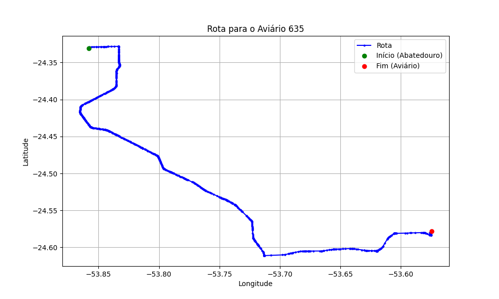

# Relatório de Rota - Aviário 635

## Informações Gerais
- **Produtor:** LUIZ CARLOS BASTOS
- **Latitude:** -24.578333
- **Longitude:** -53.573889

## Dados da Rota
- **Distância Real:** 58.34 km
- **Tempo Estimado (OSRM):** 56.8 minutos
- **Tempo Estimado (40 km/h):** 87.5 minutos

## Mapa da Rota

[Visualizar Mapa Interativo](mapa_interativo.html)

## Rota até o aviário
1. Saia da rua sem nome, siga por 10m.
2. Vire à direita na Avenida Ariosvaldo Bitencourt, siga por 200m.
3. Siga em frente na Avenida Ariosvaldo Bitencourt, siga por 2,6 km.
4. Vire em frente na Rodovia Alberto Dalcanale, siga por 38,7 km.
5. Vire levemente à esquerda na rua sem nome, siga por 130m.
6. Vire à esquerda na rua sem nome, siga por 9,6 km.
7. Fork levemente à esquerda na rua sem nome, siga por 3,0 km.
8. Vire em frente na rua sem nome, siga por 140m.
9. Fork levemente à direita na rua sem nome, siga por 60m.
10. New name em frente na PR-581, siga por 3,1 km.
11. Vire à esquerda na rua sem nome, siga por 710m.
12. Você chegará ao aviário 635 à direita.
