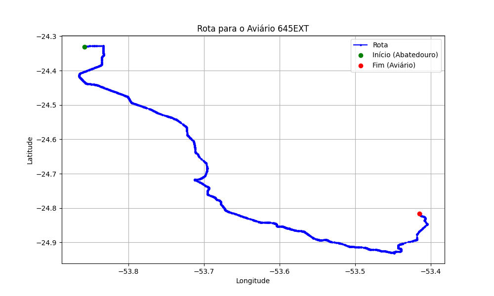

# Relatório de Rota - Aviário 645EXT

## Informações Gerais
- **Produtor:** PLUMA GILBERTO CARMO PATZOLD 6
- **Latitude:** -24.815611
- **Longitude:** -53.414778

## Dados da Rota
- **Distância Real:** 109.71 km
- **Tempo Estimado (OSRM):** 99.9 minutos
- **Tempo Estimado (40 km/h):** 164.6 minutos

## Mapa da Rota

[Visualizar Mapa Interativo](mapa_interativo.html)

## Rota até o aviário
1. Saia da rua sem nome, siga por 10m.
2. Vire à direita na Avenida Ariosvaldo Bitencourt, siga por 200m.
3. Siga em frente na Avenida Ariosvaldo Bitencourt, siga por 2,6 km.
4. Vire em frente na Rodovia Alberto Dalcanale, siga por 51,7 km.
5. Siga em frente na rua sem nome, siga por 230m.
6. Siga em frente na Rodovia Perimetral Norte, siga por 90m.
7. New name em frente na Rodovia José Neves Formighieri, siga por 38,6 km.
8. Off ramp levemente à direita na rua sem nome, siga por 500m.
9. Vire em frente na Avenida Barão do Rio Branco, siga por 50m.
10. Siga em frente na Avenida Barão do Rio Branco, siga por 250m.
11. Vire levemente à direita na Rua Ghandi, siga por 80m.
12. New name em frente na Rua Gandhi, siga por 830m.
13. New name em frente na Rua Adolfo Garcia, siga por 300m.
14. Vire à esquerda na Rua Poente do Sol, siga por 410m.
15. Vire à direita na Rua Araguari, siga por 20m.
16. Vire à esquerda na Rua Poente do Sol, siga por 500m.
17. Fork levemente à direita na Rua Poente do Sol, siga por 210m.
18. New name levemente à direita na Avenida Piquiri, siga por 2,9 km.
19. New name em frente na Estrada para Cafelândia, siga por 980m.
20. Siga em frente na Estrada para Cafelândia, siga por 160m.
21. New name em frente na PR-180, siga por 8,9 km.
22. Vire à esquerda na rua sem nome, siga por 210m.
23. Você chegará ao aviário 645EXT à direita.
