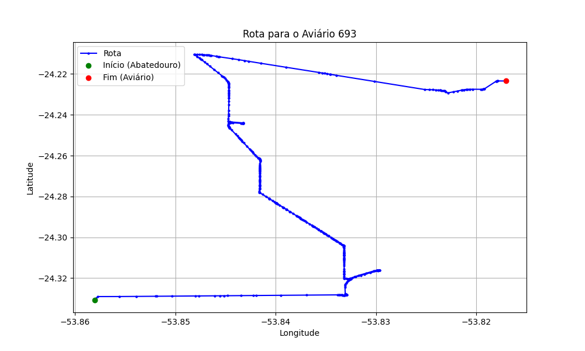

# Relatório de Rota - Aviário 693

## Informações Gerais
- **Produtor:** EDEMAR JOSE BURIN
- **Latitude:** -24.220628
- **Longitude:** -53.817005

## Dados da Rota
- **Distância Real:** 21.77 km
- **Tempo Estimado (OSRM):** 36.2 minutos
- **Tempo Estimado (40 km/h):** 32.7 minutos

## Mapa da Rota

[Visualizar Mapa Interativo](mapa_interativo.html)

## Rota até o aviário
1. Saia da rua sem nome, siga por 10m.
2. Vire à direita na Avenida Ariosvaldo Bitencourt, siga por 200m.
3. Siga em frente na Avenida Ariosvaldo Bitencourt, siga por 2,5 km.
4. Vire à esquerda na rua sem nome, siga por 1,5 km.
5. Vire levemente à esquerda na rua sem nome, siga por 660m.
6. Vire em frente na Rodovia Alberto Dalcanale, siga por 1,7 km.
7. New name em frente na Avenida Presidente Kennedy, siga por 7,2 km.
8. Fork levemente à direita na rua sem nome, siga por 3,7 km.
9. Vire à direita na rua sem nome, siga por 3,4 km.
10. Vire à esquerda na rua sem nome, siga por 420m.
11. New name levemente à esquerda na rua sem nome, siga por 570m.
12. Você chegará ao aviário 693.
