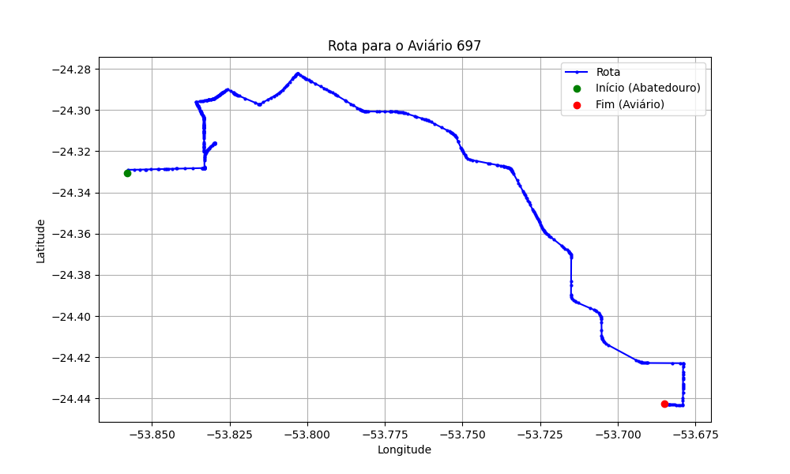

# Relatório de Rota - Aviário 697

## Informações Gerais
- **Produtor:** OSVALDO LOURENÇO BORIAN
- **Latitude:** -24.444001
- **Longitude:** -53.685757

## Dados da Rota
- **Distância Real:** 37.50 km
- **Tempo Estimado (OSRM):** 46.8 minutos
- **Tempo Estimado (40 km/h):** 56.3 minutos

## Mapa da Rota

[Visualizar Mapa Interativo](mapa_interativo.html)

## Rota até o aviário
1. Saia da rua sem nome, siga por 10m.
2. Vire à direita na Avenida Ariosvaldo Bitencourt, siga por 200m.
3. Siga em frente na Avenida Ariosvaldo Bitencourt, siga por 2,5 km.
4. Vire à esquerda na rua sem nome, siga por 1,5 km.
5. Vire levemente à esquerda na rua sem nome, siga por 660m.
6. Vire em frente na Rodovia Alberto Dalcanale, siga por 1,7 km.
7. New name em frente na Avenida Presidente Kennedy, siga por 960m.
8. Vire à direita na Rua Juscelino Kubitscheck, siga por 1,3 km.
9. Vire à direita na Rua Madre Teresa de Calcutá, siga por 440m.
10. New name em frente na rua sem nome, siga por 880m.
11. Vire à esquerda na rua sem nome, siga por 2,1 km.
12. Vire levemente à direita na Rodovia Deputado Edilson Alencar, siga por 22,4 km.
13. Vire à direita na rua sem nome, siga por 2,3 km.
14. Vire à direita na rua sem nome, siga por 610m.
15. Você chegará ao aviário 697 à esquerda.
