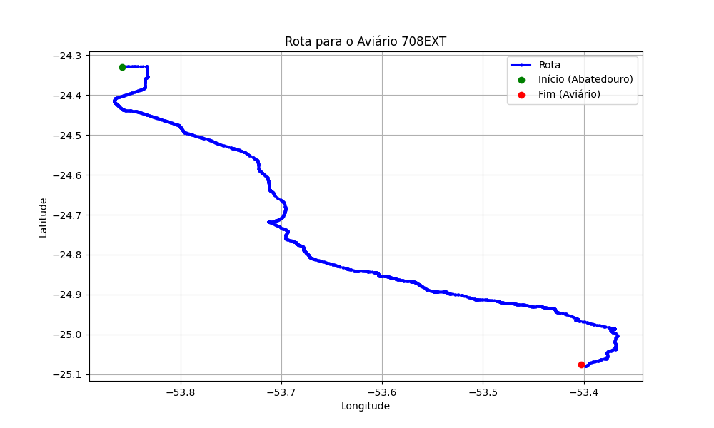

# Relatório de Rota - Aviário 708EXT

## Informações Gerais
- **Produtor:** PLUMA ABEL CONCEIÇÃO
- **Latitude:** -25.07491
- **Longitude:** -53.40202

## Dados da Rota
- **Distância Real:** 117.94 km
- **Tempo Estimado (OSRM):** 103.1 minutos
- **Tempo Estimado (40 km/h):** 176.9 minutos

## Mapa da Rota

[Visualizar Mapa Interativo](mapa_interativo.html)

## Rota até o aviário
1. Saia da rua sem nome, siga por 10m.
2. Vire à direita na Avenida Ariosvaldo Bitencourt, siga por 200m.
3. Siga em frente na Avenida Ariosvaldo Bitencourt, siga por 2,6 km.
4. Vire em frente na Rodovia Alberto Dalcanale, siga por 51,7 km.
5. Siga em frente na rua sem nome, siga por 230m.
6. Siga em frente na Rodovia Perimetral Norte, siga por 90m.
7. New name em frente na Rodovia José Neves Formighieri, siga por 45,5 km.
8. Siga em frente na rua sem nome, siga por 140m.
9. Off ramp levemente à esquerda na rua sem nome, siga por 310m.
10. Fork levemente à direita na rua sem nome, siga por 210m.
11. New name em frente na rua sem nome, siga por 3,8 km.
12. Off ramp levemente à direita na rua sem nome, siga por 270m.
13. Vire à direita na Rodovia Horácio Ribeiro dos Reis, siga por 710m.
14. Siga em frente na Rodovia Horácio Ribeiro dos Reis, siga por 7,5 km.
15. Vire levemente à direita na Linha São Salvador, siga por 1,0 km.
16. Vire à direita na Estrada Scanagatta, siga por 3,1 km.
17. Vire à direita na Linha Castanha, siga por 600m.
18. Você chegará ao aviário 708EXT à direita.
