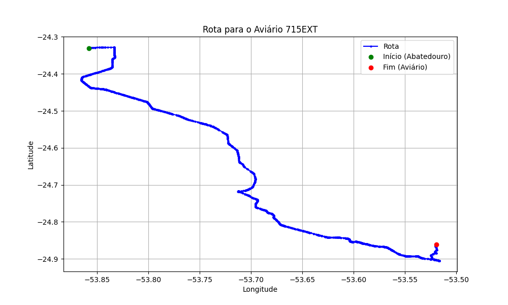

# Relatório de Rota - Aviário 715EXT

## Informações Gerais
- **Produtor:** PLUMA TATIANE KESIA KAMEI BESAGIO 1
- **Latitude:** -24.860905
- **Longitude:** -53.520309

## Dados da Rota
- **Distância Real:** 92.08 km
- **Tempo Estimado (OSRM):** 80.5 minutos
- **Tempo Estimado (40 km/h):** 138.1 minutos

## Mapa da Rota

[Visualizar Mapa Interativo](mapa_interativo.html)

## Rota até o aviário
1. Saia da rua sem nome, siga por 10m.
2. Vire à direita na Avenida Ariosvaldo Bitencourt, siga por 200m.
3. Siga em frente na Avenida Ariosvaldo Bitencourt, siga por 2,6 km.
4. Vire em frente na Rodovia Alberto Dalcanale, siga por 51,7 km.
5. Siga em frente na rua sem nome, siga por 230m.
6. Siga em frente na Rodovia Perimetral Norte, siga por 90m.
7. New name em frente na Rodovia José Neves Formighieri, siga por 31,2 km.
8. Off ramp levemente à esquerda na rua sem nome, siga por 170m.
9. End of road à esquerda na rua sem nome, siga por 150m.
10. Siga em frente na Rodovia José Neves Formighieri, siga por 850m.
11. Vire levemente à direita na rua sem nome, siga por 1,2 km.
12. Fork levemente à direita na rua sem nome, siga por 930m.
13. Vire levemente à esquerda na rua sem nome, siga por 2,3 km.
14. Fork levemente à direita na rua sem nome, siga por 430m.
15. Você chegará ao aviário 715EXT à esquerda.
