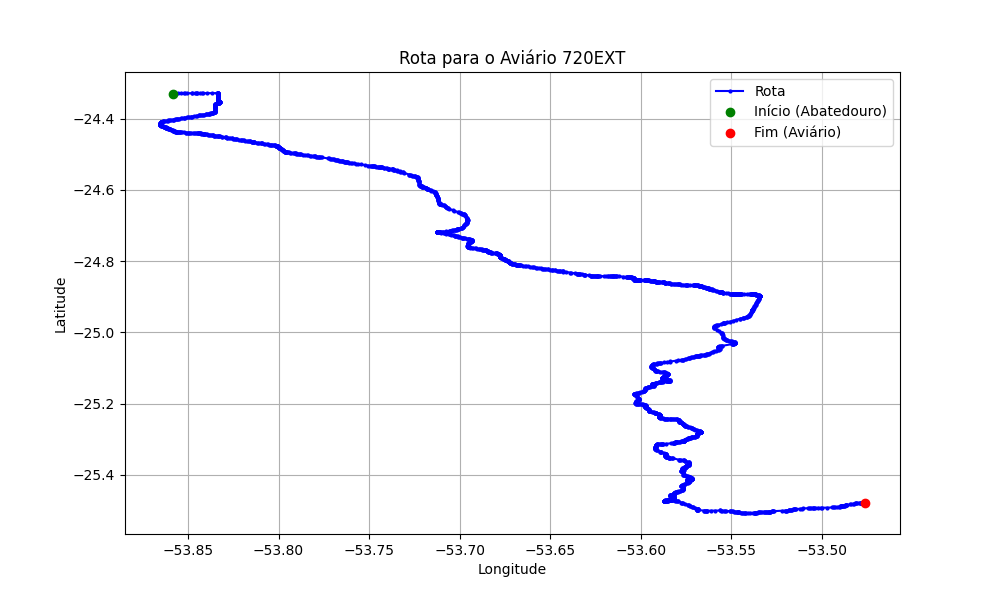

# Relatório de Rota - Aviário 720EXT

## Informações Gerais
- **Produtor:** PLUMA ELIAS DE OLIVEIRA 1
- **Latitude:** -25.478583
- **Longitude:** -53.476295

## Dados da Rota
- **Distância Real:** 170.73 km
- **Tempo Estimado (OSRM):** 149.0 minutos
- **Tempo Estimado (40 km/h):** 256.1 minutos

## Mapa da Rota

[Visualizar Mapa Interativo](mapa_interativo.html)

## Rota até o aviário
1. Saia da rua sem nome, siga por 10m.
2. Vire à direita na Avenida Ariosvaldo Bitencourt, siga por 200m.
3. Siga em frente na Avenida Ariosvaldo Bitencourt, siga por 2,6 km.
4. Vire em frente na Rodovia Alberto Dalcanale, siga por 51,7 km.
5. Siga em frente na rua sem nome, siga por 230m.
6. Siga em frente na Rodovia Perimetral Norte, siga por 90m.
7. New name em frente na Rodovia José Neves Formighieri, siga por 29,3 km.
8. Off ramp levemente à direita na rua sem nome, siga por 45,4 km.
9. Siga em frente na Avenida Souza Naves, siga por 3,1 km.
10. Vire em frente na Rodovia Deputado Arnaldo Faivro Busato, siga por 23,3 km.
11. End of road acentuadamente à esquerda na Rodovia Deputado Arnaldo Faivro Busato, siga por 360m.
12. Vire levemente à direita na rua sem nome, siga por 14,1 km.
13. Vire à direita na Rua Armelindo Shustter, siga por 200m.
14. Siga em frente na Rua Armelindo Shustter, siga por 230m.
15. Você chegará ao aviário 720EXT.
