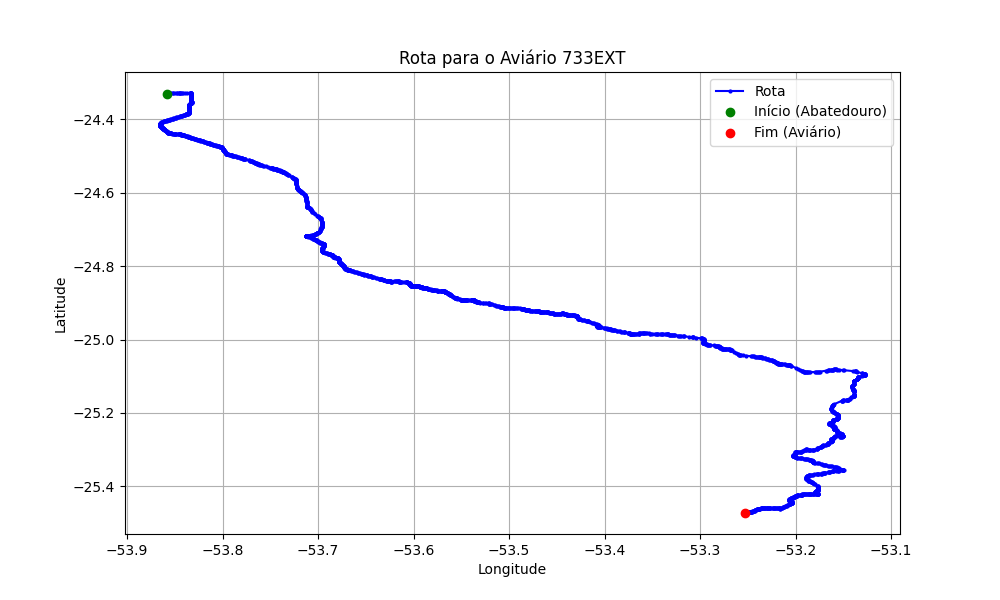

# Relatório de Rota - Aviário 733EXT

## Informações Gerais
- **Produtor:** PLUMA DIRCEU HILARIO HANEL 1
- **Latitude:** -25.473056
- **Longitude:** -53.252306

## Dados da Rota
- **Distância Real:** 195.04 km
- **Tempo Estimado (OSRM):** 181.0 minutos
- **Tempo Estimado (40 km/h):** 292.6 minutos

## Mapa da Rota

[Visualizar Mapa Interativo](mapa_interativo.html)

## Rota até o aviário
1. Saia da rua sem nome, siga por 10m.
2. Vire à direita na Avenida Ariosvaldo Bitencourt, siga por 200m.
3. Siga em frente na Avenida Ariosvaldo Bitencourt, siga por 2,6 km.
4. Vire em frente na Rodovia Alberto Dalcanale, siga por 51,7 km.
5. Siga em frente na rua sem nome, siga por 230m.
6. Siga em frente na Rodovia Perimetral Norte, siga por 90m.
7. New name em frente na Rodovia José Neves Formighieri, siga por 45,5 km.
8. Siga em frente na rua sem nome, siga por 140m.
9. Off ramp levemente à esquerda na rua sem nome, siga por 310m.
10. Fork levemente à direita na rua sem nome, siga por 210m.
11. New name em frente na rua sem nome, siga por 34,5 km.
12. Vire à direita na Rodovia Ozório Alves de Oliveira, siga por 70m.
13. Exit rotary em frente na Rodovia Ozório Alves de Oliveira, siga por 13,7 km.
14. New name levemente à direita na Avenida Augusto Gomes de Oliveira, siga por 34,4 km.
15. Vire à direita na Avenida Brasil, siga por 1,7 km.
16. Vire à esquerda na Rodovia PR-471, siga por 5,3 km.
17. Vire à direita na rua sem nome, siga por 4,3 km.
18. Você chegará ao aviário 733EXT à esquerda.
