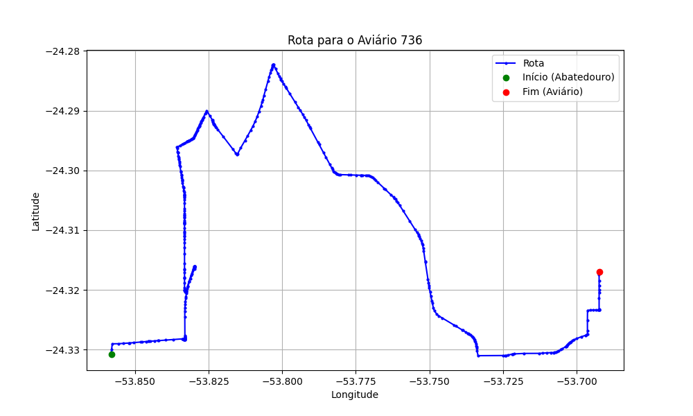

# Relatório de Rota - Aviário 736

## Informações Gerais
- **Produtor:** JEAN CARLOS BOTTINI
- **Latitude:** -24.31702
- **Longitude:** -53.69123

## Dados da Rota
- **Distância Real:** 27.10 km
- **Tempo Estimado (OSRM):** 35.2 minutos
- **Tempo Estimado (40 km/h):** 40.7 minutos

## Mapa da Rota

[Visualizar Mapa Interativo](mapa_interativo.html)

## Rota até o aviário
1. Saia da rua sem nome, siga por 10m.
2. Vire à direita na Avenida Ariosvaldo Bitencourt, siga por 200m.
3. Siga em frente na Avenida Ariosvaldo Bitencourt, siga por 2,5 km.
4. Vire à esquerda na rua sem nome, siga por 1,5 km.
5. Vire levemente à esquerda na rua sem nome, siga por 660m.
6. Vire em frente na Rodovia Alberto Dalcanale, siga por 1,7 km.
7. New name em frente na Avenida Presidente Kennedy, siga por 960m.
8. Vire à direita na Rua Juscelino Kubitscheck, siga por 1,3 km.
9. Vire à direita na Rua Madre Teresa de Calcutá, siga por 440m.
10. New name em frente na rua sem nome, siga por 880m.
11. Vire à esquerda na rua sem nome, siga por 2,1 km.
12. Vire levemente à direita na Rodovia Deputado Edilson Alencar, siga por 9,5 km.
13. Vire à esquerda na rua sem nome, siga por 3,8 km.
14. End of road à esquerda na Rua Equador, siga por 440m.
15. Vire à direita na Rua Distrito Federal, siga por 390m.
16. Vire à esquerda na Para Umuarama, siga por 710m.
17. Você chegará ao aviário 736 à direita.
