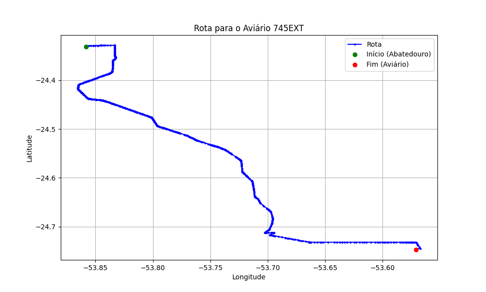

# Relatório de Rota - Aviário 745EXT

## Informações Gerais
- **Produtor:** LAR SIRLEI BARBOSA SANTANA 2910
- **Latitude:** -24.746935
- **Longitude:** -53.570192

## Dados da Rota
- **Distância Real:** 70.16 km
- **Tempo Estimado (OSRM):** 67.3 minutos
- **Tempo Estimado (40 km/h):** 105.2 minutos

## Mapa da Rota

[Visualizar Mapa Interativo](mapa_interativo.html)

## Rota até o aviário
1. Saia da rua sem nome, siga por 10m.
2. Vire à direita na Avenida Ariosvaldo Bitencourt, siga por 200m.
3. Siga em frente na Avenida Ariosvaldo Bitencourt, siga por 2,6 km.
4. Vire em frente na Rodovia Alberto Dalcanale, siga por 50,5 km.
5. Vire à esquerda na rua sem nome, siga por 70m.
6. Vire levemente à esquerda na rua sem nome, siga por 760m.
7. Vire acentuadamente à direita na rua sem nome, siga por 610m.
8. Vire à esquerda na Estrada para São Luiz do Oeste, siga por 12,8 km.
9. New name em frente na Avenida Presidente Kennedy, siga por 430m.
10. Vire à direita na Rua São Luís, siga por 1,5 km.
11. Vire à direita na rua sem nome, siga por 490m.
12. Vire à esquerda na rua sem nome, siga por 220m.
13. Você chegará ao aviário 745EXT.
