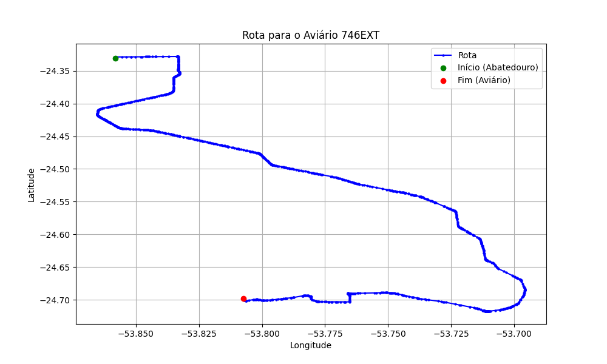

# Relatório de Rota - Aviário 746EXT

## Informações Gerais
- **Produtor:** LAR CARLOS ALBERTO MARTINAZZO 1566
- **Latitude:** -24.698111
- **Longitude:** -53.807444

## Dados da Rota
- **Distância Real:** 68.15 km
- **Tempo Estimado (OSRM):** 64.2 minutos
- **Tempo Estimado (40 km/h):** 102.2 minutos

## Mapa da Rota

[Visualizar Mapa Interativo](mapa_interativo.html)

## Rota até o aviário
1. Saia da rua sem nome, siga por 10m.
2. Vire à direita na Avenida Ariosvaldo Bitencourt, siga por 200m.
3. Siga em frente na Avenida Ariosvaldo Bitencourt, siga por 2,6 km.
4. Vire em frente na Rodovia Alberto Dalcanale, siga por 51,4 km.
5. Siga em frente na rua sem nome, siga por 330m.
6. Siga em frente na Rodovia Perimetral Norte, siga por 6,0 km.
7. Off ramp levemente à direita na rua sem nome, siga por 490m.
8. Vire à esquerda na Avenida Ministro Cirne Lima, siga por 1,5 km.
9. Vire à direita na Rua João Orestes Ruaro, siga por 1,2 km.
10. New name em frente na Linha Rural Nova Videira, siga por 4,0 km.
11. Vire à direita na rua sem nome, siga por 400m.
12. Você chegará ao aviário 746EXT à esquerda.
