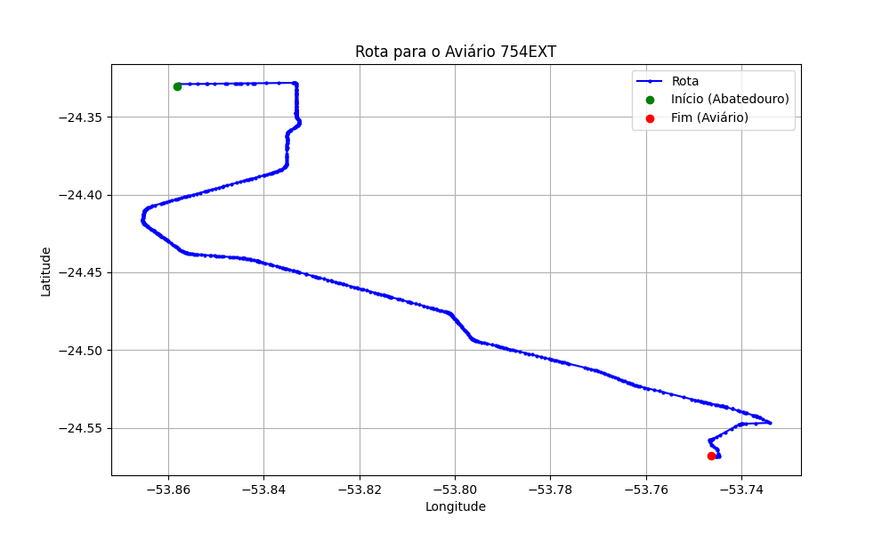

# Relatório de Rota - Aviário 754EXT

## Informações Gerais
- **Produtor:** LAR IEDA TERRA TREMEA 1417
- **Latitude:** -24.568056
- **Longitude:** -53.746333

## Dados da Rota
- **Distância Real:** 37.41 km
- **Tempo Estimado (OSRM):** 39.1 minutos
- **Tempo Estimado (40 km/h):** 56.1 minutos

## Mapa da Rota

[Visualizar Mapa Interativo](mapa_interativo.html)

## Rota até o aviário
1. Saia da rua sem nome, siga por 10m.
2. Vire à direita na Avenida Ariosvaldo Bitencourt, siga por 200m.
3. Siga em frente na Avenida Ariosvaldo Bitencourt, siga por 2,6 km.
4. Vire em frente na Rodovia Alberto Dalcanale, siga por 31,2 km.
5. Vire à direita na rua sem nome, siga por 3,1 km.
6. Vire à direita na rua sem nome, siga por 190m.
7. Você chegará ao aviário 754EXT à direita.
