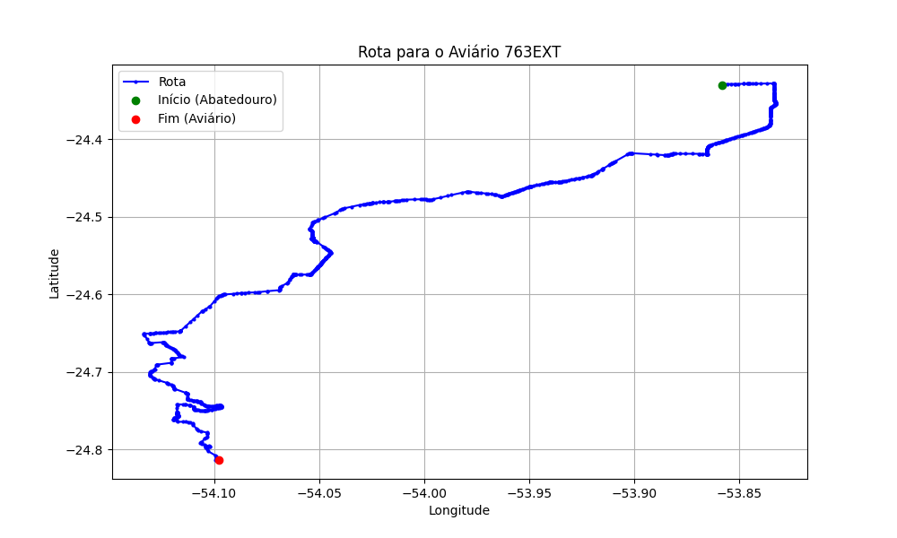

# Relatório de Rota - Aviário 763EXT

## Informações Gerais
- **Produtor:** LAR JAIR VERONEZZI 2406
- **Latitude:** -24.812588
- **Longitude:** -54.09763

## Dados da Rota
- **Distância Real:** 86.12 km
- **Tempo Estimado (OSRM):** 99.8 minutos
- **Tempo Estimado (40 km/h):** 129.2 minutos

## Mapa da Rota

[Visualizar Mapa Interativo](mapa_interativo.html)

## Rota até o aviário
1. Saia da rua sem nome, siga por 10m.
2. Vire à direita na Avenida Ariosvaldo Bitencourt, siga por 200m.
3. Siga em frente na Avenida Ariosvaldo Bitencourt, siga por 2,6 km.
4. Vire em frente na Rodovia Alberto Dalcanale, siga por 11,1 km.
5. Siga em frente na rua sem nome, siga por 60m.
6. Vire levemente à direita na rua sem nome, siga por 2,0 km.
7. Vire em frente na rua sem nome, siga por 1,8 km.
8. Vire em frente na rua sem nome, siga por 10,9 km.
9. Vire em frente na rua sem nome, siga por 11,5 km.
10. Roundabout à direita na rua sem nome, siga por 30m.
11. Exit roundabout em frente na rua sem nome, siga por 60m.
12. Roundabout em frente na Avenida Maripa, siga por 40m.
13. Exit roundabout em frente na Avenida Maripa, siga por 290m.
14. Roundabout levemente à direita na Avenida Maripá, siga por 50m.
15. Exit roundabout levemente à direita na Avenida Maripá, siga por 170m.
16. Siga em frente na rua sem nome, siga por 1,3 km.
17. Off ramp levemente à direita na rua sem nome, siga por 460m.
18. Roundabout à direita na Avenida Irio Jacob Welp, siga por 0m.
19. Exit roundabout levemente à direita na Avenida Irio Jacob Welp, siga por 720m.
20. Roundabout levemente à direita na Avenida Irio Jacob Welp, siga por 30m.
21. Exit roundabout à direita na Avenida Irio Jacob Welp, siga por 930m.
22. Roundabout levemente à direita na Avenida Irio Jacob Welp, siga por 20m.
23. Exit roundabout levemente à direita na Avenida Irio Jacob Welp, siga por 590m.
24. Siga em frente na Avenida Irio Jacob Welp, siga por 850m.
25. Vire levemente à direita na Anel Viário Helmut Priesnitz, siga por 90m.
26. Vire levemente à direita na Rua Helmuth Priesnitz, siga por 740m.
27. Vire levemente à direita na rua sem nome, siga por 100m.
28. Vire à direita na rua sem nome, siga por 20m.
29. Vire levemente à direita na Rodovia Municipal Antônio Krenchinski, siga por 2,3 km.
30. Siga em frente na Rodovia Municipal Antônio Krenchinski, siga por 8,5 km.
31. New name em frente na Avenida Prata, siga por 1,5 km.
32. New name em frente na Rodovia Municipal Antônio Krenchinski, siga por 320m.
33. Vire à esquerda na Rodovia Municipal Antônio Krenchinski, siga por 1,3 km.
34. Siga em frente na Rodovia Municipal Antônio Krenchinski, siga por 700m.
35. Siga em frente na Rodovia Municipal Antônio Krenchinski, siga por 2,4 km.
36. Vire à direita na rua sem nome, siga por 1,2 km.
37. Vire à direita na rua sem nome, siga por 4,1 km.
38. New name em frente na rua sem nome, siga por 4,4 km.
39. Vire à direita na rua sem nome, siga por 3,1 km.
40. Vire à esquerda na rua sem nome, siga por 2,7 km.
41. End of road à esquerda na rua sem nome, siga por 6,8 km.
42. Vire à esquerda na Rodovia Doutor Ivo Rocha, siga por 170m.
43. Você chegará ao aviário 763EXT à esquerda.
