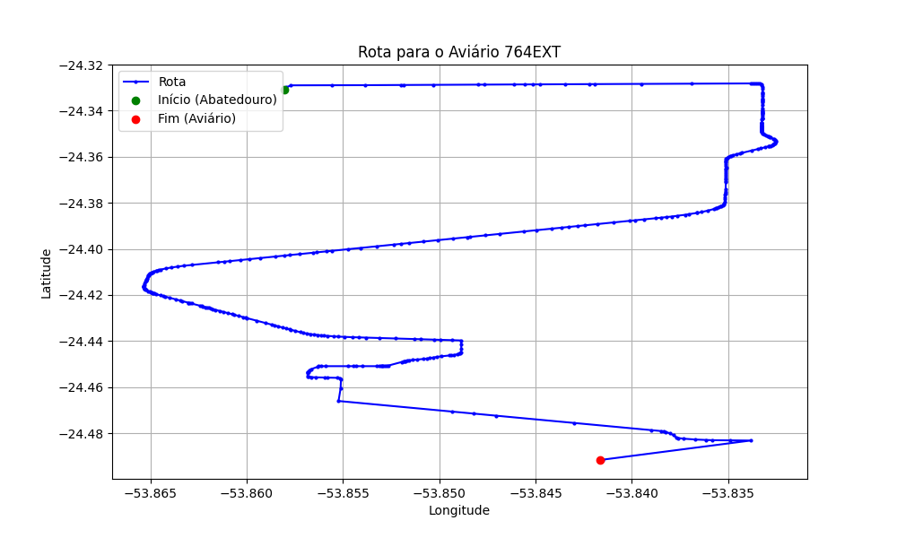

# Relatório de Rota - Aviário 764EXT

## Informações Gerais
- **Produtor:** LAR IRIS KRUGER PETTER 2546
- **Latitude:** -24.491819
- **Longitude:** -53.84143

## Dados da Rota
- **Distância Real:** 24.79 km
- **Tempo Estimado (OSRM):** 35.7 minutos
- **Tempo Estimado (40 km/h):** 37.2 minutos

## Mapa da Rota

[Visualizar Mapa Interativo](mapa_interativo.html)

## Rota até o aviário
1. Saia da rua sem nome, siga por 10m.
2. Vire à direita na Avenida Ariosvaldo Bitencourt, siga por 200m.
3. Siga em frente na Avenida Ariosvaldo Bitencourt, siga por 2,6 km.
4. Vire em frente na Rodovia Alberto Dalcanale, siga por 14,2 km.
5. Vire à direita na rua sem nome, siga por 6,5 km.
6. Vire acentuadamente à direita na rua sem nome, siga por 1,2 km.
7. Você chegará ao aviário 764EXT à esquerda.
