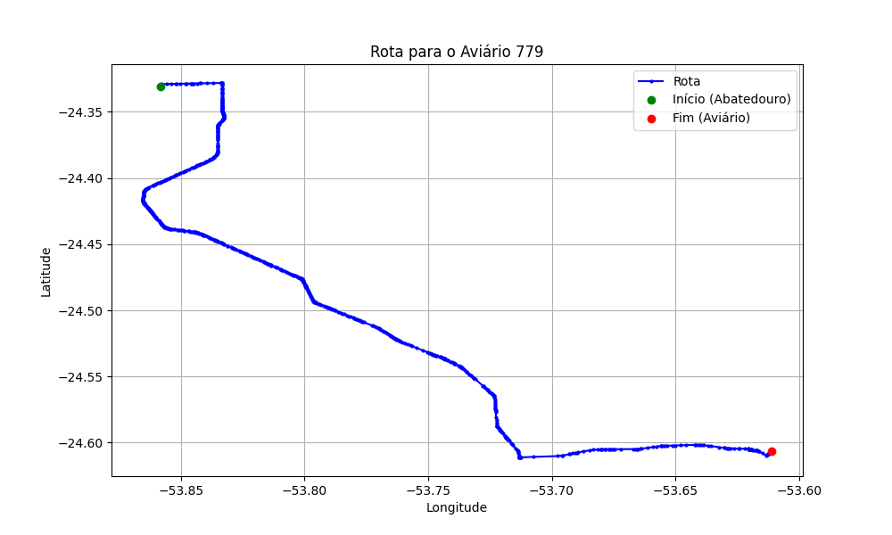

# Relatório de Rota - Aviário 779

## Informações Gerais
- **Produtor:** MAIKON GUERRA MENDES
- **Latitude:** -24.606639
- **Longitude:** -53.610667

## Dados da Rota
- **Distância Real:** 52.64 km
- **Tempo Estimado (OSRM):** 49.9 minutos
- **Tempo Estimado (40 km/h):** 79.0 minutos

## Mapa da Rota

[Visualizar Mapa Interativo](mapa_interativo.html)

## Rota até o aviário
1. Saia da rua sem nome, siga por 10m.
2. Vire à direita na Avenida Ariosvaldo Bitencourt, siga por 200m.
3. Siga em frente na Avenida Ariosvaldo Bitencourt, siga por 2,6 km.
4. Vire em frente na Rodovia Alberto Dalcanale, siga por 38,7 km.
5. Vire levemente à esquerda na rua sem nome, siga por 130m.
6. Vire à esquerda na rua sem nome, siga por 9,6 km.
7. Fork levemente à direita na rua sem nome, siga por 210m.
8. Vire à esquerda na Travessa iguaçu, siga por 100m.
9. Vire à direita na Rua São Pedro, siga por 600m.
10. Vire à esquerda na Travessa Antonio Martins, siga por 180m.
11. Siga em frente na Travessa Antonio Martins, siga por 260m.
12. Você chegará ao aviário 779 à direita.
