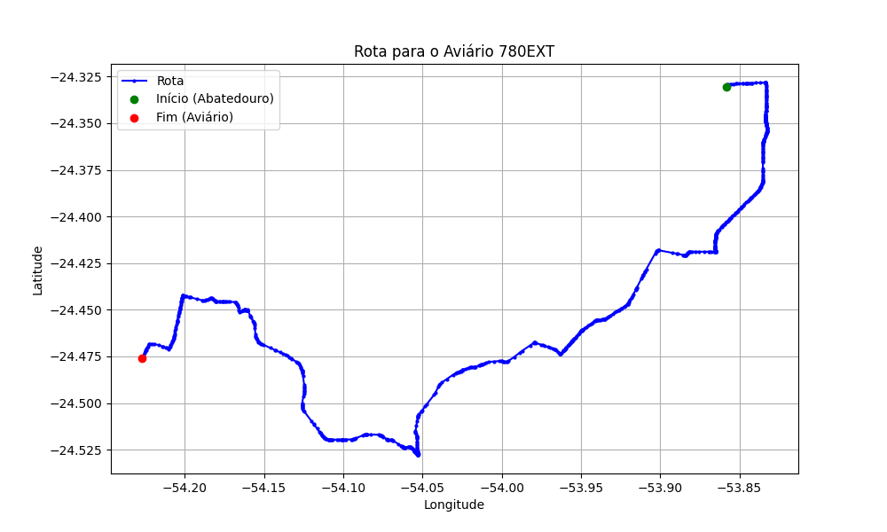

# Relatório de Rota - Aviário 780EXT

## Informações Gerais
- **Produtor:** LAR MARCIO BUSS 2473
- **Latitude:** -24.475891
- **Longitude:** -54.226819

## Dados da Rota
- **Distância Real:** 66.84 km
- **Tempo Estimado (OSRM):** 74.7 minutos
- **Tempo Estimado (40 km/h):** 100.3 minutos

## Mapa da Rota

[Visualizar Mapa Interativo](mapa_interativo.html)

## Rota até o aviário
1. Saia da rua sem nome, siga por 10m.
2. Vire à direita na Avenida Ariosvaldo Bitencourt, siga por 200m.
3. Siga em frente na Avenida Ariosvaldo Bitencourt, siga por 2,6 km.
4. Vire em frente na Rodovia Alberto Dalcanale, siga por 11,1 km.
5. Siga em frente na rua sem nome, siga por 60m.
6. Vire levemente à direita na rua sem nome, siga por 2,0 km.
7. Vire em frente na rua sem nome, siga por 1,8 km.
8. Vire em frente na rua sem nome, siga por 10,9 km.
9. Vire em frente na rua sem nome, siga por 11,5 km.
10. Roundabout à direita na rua sem nome, siga por 10m.
11. Exit roundabout levemente à direita na rua sem nome, siga por 300m.
12. Siga em frente na rua sem nome, siga por 16,1 km.
13. Vire acentuadamente à esquerda na Avenida Doutor Mário Totta, siga por 550m.
14. Vire à direita na Avenida João XXIII, siga por 620m.
15. Vire à esquerda na Rua Quito, siga por 3,6 km.
16. Vire à esquerda na rua sem nome, siga por 3,3 km.
17. End of road à direita na rua sem nome, siga por 1,3 km.
18. Vire à esquerda na rua sem nome, siga por 940m.
19. Você chegará ao aviário 780EXT.
