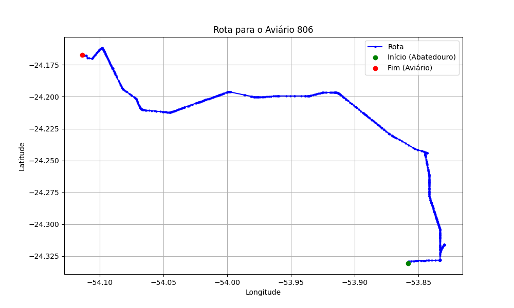

# Relatório de Rota - Aviário 806

## Informações Gerais
- **Produtor:** VALDIR ANOR DE ASSIS
- **Latitude:** -24.166556
- **Longitude:** -54.113333

## Dados da Rota
- **Distância Real:** 47.09 km
- **Tempo Estimado (OSRM):** 52.9 minutos
- **Tempo Estimado (40 km/h):** 70.6 minutos

## Mapa da Rota

[Visualizar Mapa Interativo](mapa_interativo.html)

## Rota até o aviário
1. Saia da rua sem nome, siga por 10m.
2. Vire à direita na Avenida Ariosvaldo Bitencourt, siga por 200m.
3. Siga em frente na Avenida Ariosvaldo Bitencourt, siga por 2,5 km.
4. Vire à esquerda na rua sem nome, siga por 1,5 km.
5. Vire levemente à esquerda na rua sem nome, siga por 660m.
6. Vire em frente na Rodovia Alberto Dalcanale, siga por 1,7 km.
7. New name em frente na Avenida Presidente Kennedy, siga por 7,2 km.
8. Fork levemente à esquerda na rua sem nome, siga por 2,9 km.
9. New name em frente na rua sem nome, siga por 26,3 km.
10. Roundabout à direita na Avenida Presidente Castelo Branco, siga por 60m.
11. Exit roundabout levemente à direita na Avenida Presidente Castelo Branco, siga por 1,9 km.
12. Vire à esquerda na Avenida da Saudade, siga por 1,3 km.
13. Vire à direita na Estrada Cachimbeiro, siga por 360m.
14. Vire à direita na rua sem nome, siga por 220m.
15. Vire à esquerda na rua sem nome, siga por 320m.
16. End of road à direita na rua sem nome, siga por 20m.
17. Você chegará ao aviário 806 à direita.
