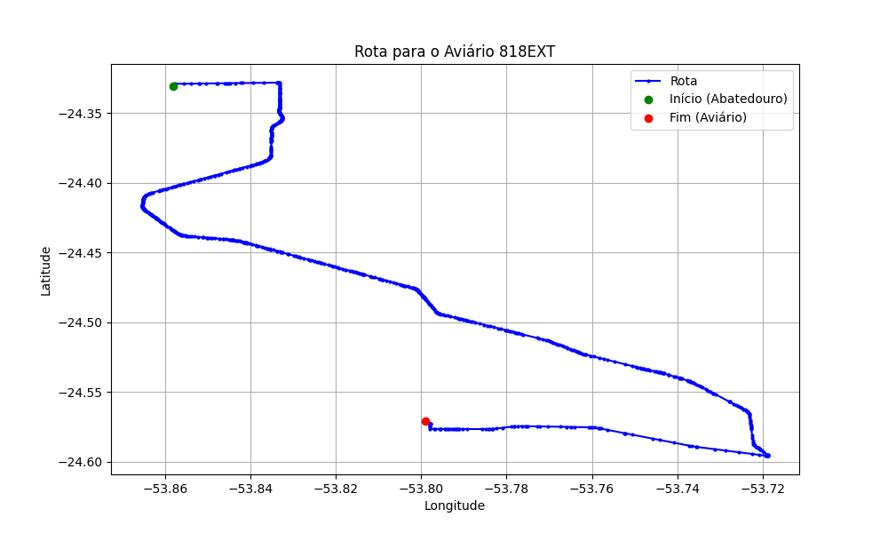

# Relatório de Rota - Aviário 818EXT

## Informações Gerais
- **Produtor:** LAR LEONI ROQUE BIANCHI  1324
- **Latitude:** -24.571767
- **Longitude:** -53.800376

## Dados da Rota
- **Distância Real:** 49.14 km
- **Tempo Estimado (OSRM):** 45.3 minutos
- **Tempo Estimado (40 km/h):** 73.7 minutos

## Mapa da Rota

[Visualizar Mapa Interativo](mapa_interativo.html)

## Rota até o aviário
1. Saia da rua sem nome, siga por 10m.
2. Vire à direita na Avenida Ariosvaldo Bitencourt, siga por 200m.
3. Siga em frente na Avenida Ariosvaldo Bitencourt, siga por 2,6 km.
4. Vire em frente na Rodovia Alberto Dalcanale, siga por 37,0 km.
5. Vire acentuadamente à direita na rua sem nome, siga por 8,7 km.
6. Vire à direita na Rua Carlos Gomes, siga por 650m.
7. Você chegará ao aviário 818EXT à esquerda.
