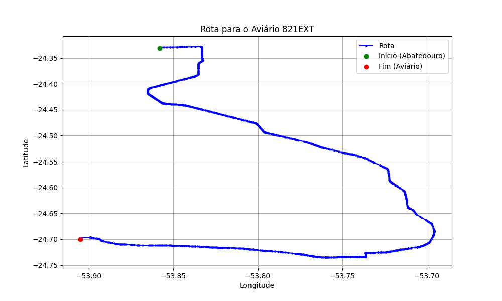

# Relatório de Rota - Aviário 821EXT

## Informações Gerais
- **Produtor:** LAR VALDIR ROQUE PORTZ  1544
- **Latitude:** -24.699138
- **Longitude:** -53.906861

## Dados da Rota
- **Distância Real:** 76.47 km
- **Tempo Estimado (OSRM):** 76.3 minutos
- **Tempo Estimado (40 km/h):** 114.7 minutos

## Mapa da Rota

[Visualizar Mapa Interativo](mapa_interativo.html)

## Rota até o aviário
1. Saia da rua sem nome, siga por 10m.
2. Vire à direita na Avenida Ariosvaldo Bitencourt, siga por 200m.
3. Siga em frente na Avenida Ariosvaldo Bitencourt, siga por 2,6 km.
4. Vire em frente na Rodovia Alberto Dalcanale, siga por 51,8 km.
5. New name em frente na Avenida Parigot de Souza, siga por 330m.
6. Roundabout em frente na Avenida José João Muraro, siga por 50m.
7. Exit roundabout à direita na Avenida José João Muraro, siga por 990m.
8. Roundabout à direita na Avenida José João Muraro, siga por 20m.
9. Exit roundabout levemente à direita na Avenida José João Muraro, siga por 1,2 km.
10. Roundabout à direita na Rua São João, siga por 50m.
11. Exit roundabout em frente na Rua São João, siga por 820m.
12. Roundabout levemente à direita na Avenida Maripá, siga por 10m.
13. Exit roundabout à direita na Avenida Maripá, siga por 2,4 km.
14. Roundabout levemente à direita na Avenida Maripá, siga por 30m.
15. Exit roundabout em frente na Avenida Maripá, siga por 600m.
16. Roundabout em frente na Avenida Maripá, siga por 10m.
17. Exit roundabout em frente na Avenida Maripá, siga por 740m.
18. Roundabout à direita na Avenida Maripá, siga por 50m.
19. Exit roundabout levemente à direita na Avenida Maripá, siga por 50m.
20. New name levemente à direita na OT-06, siga por 7,9 km.
21. New name levemente à direita na Avenida do Comércio, siga por 470m.
22. Vire em frente na OT-06, siga por 5,4 km.
23. Vire à esquerda na rua sem nome, siga por 800m.
24. Você chegará ao aviário 821EXT à direita.
