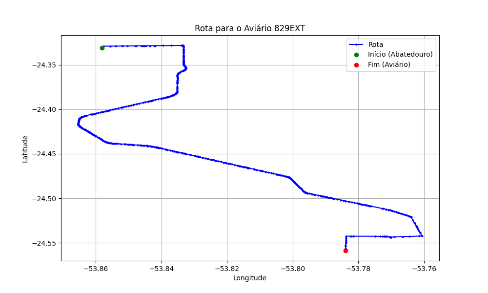

# Relatório de Rota - Aviário 829EXT

## Informações Gerais
- **Produtor:** LAR ESPOLIO LEANDRO LUIS SCHWENGBER 2224
- **Latitude:** -24.558667
- **Longitude:** -53.784333

## Dados da Rota
- **Distância Real:** 36.45 km
- **Tempo Estimado (OSRM):** 43.3 minutos
- **Tempo Estimado (40 km/h):** 54.7 minutos

## Mapa da Rota

[Visualizar Mapa Interativo](mapa_interativo.html)

## Rota até o aviário
1. Saia da rua sem nome, siga por 10m.
2. Vire à direita na Avenida Ariosvaldo Bitencourt, siga por 200m.
3. Siga em frente na Avenida Ariosvaldo Bitencourt, siga por 2,6 km.
4. Vire em frente na Rodovia Alberto Dalcanale, siga por 27,0 km.
5. Vire à direita na rua sem nome, siga por 2,4 km.
6. Vire à direita na rua sem nome, siga por 2,4 km.
7. End of road à esquerda na rua sem nome, siga por 1,8 km.
8. Você chegará ao aviário 829EXT à direita.
