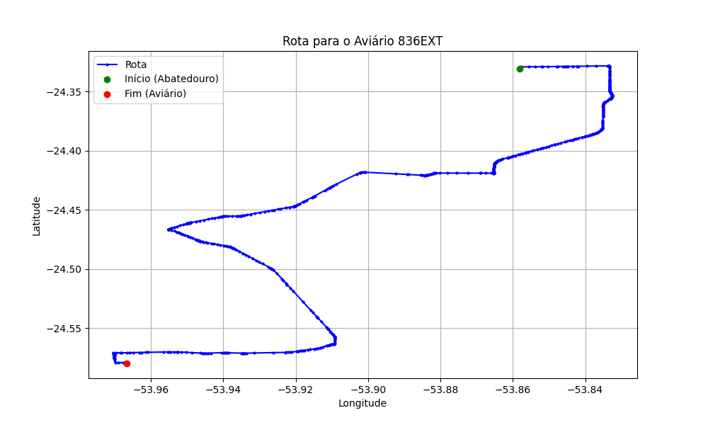

# Relatório de Rota - Aviário 836EXT

## Informações Gerais
- **Produtor:** LAR IRINEU FREDERICO TOILLIER 2186
- **Latitude:** -24.58025
- **Longitude:** -53.967194

## Dados da Rota
- **Distância Real:** 45.63 km
- **Tempo Estimado (OSRM):** 47.6 minutos
- **Tempo Estimado (40 km/h):** 68.4 minutos

## Mapa da Rota

[Visualizar Mapa Interativo](mapa_interativo.html)

## Rota até o aviário
1. Saia da rua sem nome, siga por 10m.
2. Vire à direita na Avenida Ariosvaldo Bitencourt, siga por 200m.
3. Siga em frente na Avenida Ariosvaldo Bitencourt, siga por 2,6 km.
4. Vire em frente na Rodovia Alberto Dalcanale, siga por 11,1 km.
5. Siga em frente na rua sem nome, siga por 60m.
6. Vire levemente à direita na rua sem nome, siga por 2,0 km.
7. Vire em frente na rua sem nome, siga por 1,8 km.
8. Vire em frente na rua sem nome, siga por 8,0 km.
9. Vire à esquerda na rua sem nome, siga por 20m.
10. Vire à direita na Avenida Horizontina, siga por 1,2 km.
11. New name em frente na Rodovia Prefeito Daniel Wutzke, siga por 10,9 km.
12. Vire à direita na rua sem nome, siga por 6,4 km.
13. Vire à esquerda na Rua São Leopoldo, siga por 120m.
14. Vire à esquerda na Rua Nelson Minks, siga por 20m.
15. Vire à direita na Rua São Leopoldo, siga por 120m.
16. Vire à direita na Rua Gaspar Martins, siga por 20m.
17. Vire à esquerda na Rua São Leopoldo, siga por 240m.
18. New name em frente na Linha Sanga Leão, siga por 430m.
19. Vire à esquerda na rua sem nome, siga por 360m.
20. Você chegará ao aviário 836EXT à direita.
