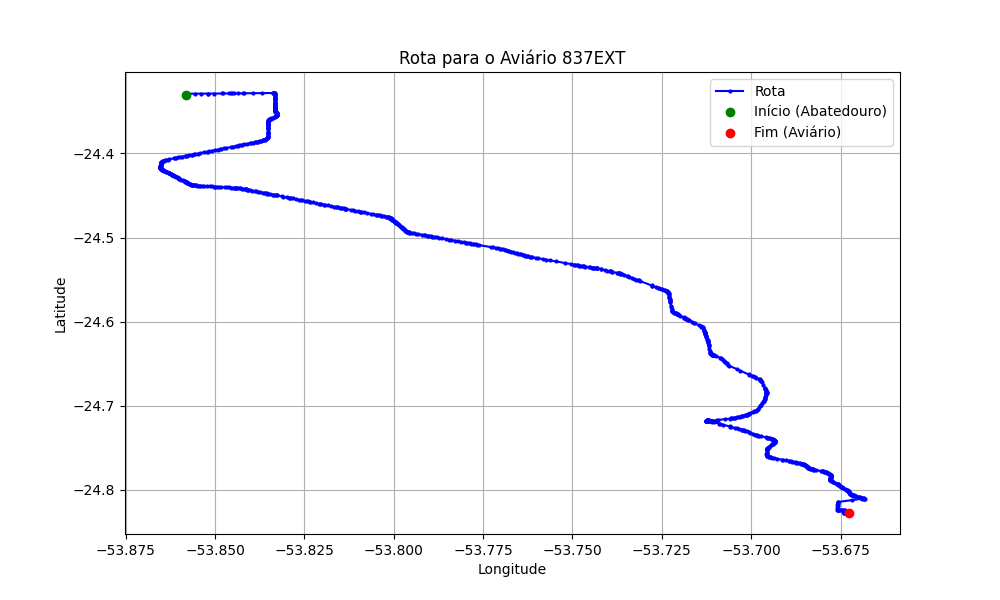

# Relatório de Rota - Aviário 837EXT

## Informações Gerais
- **Produtor:** LAR JOSE LUIS GARLET 1653
- **Latitude:** -24.826361
- **Longitude:** -53.672833

## Dados da Rota
- **Distância Real:** 69.14 km
- **Tempo Estimado (OSRM):** 64.0 minutos
- **Tempo Estimado (40 km/h):** 103.7 minutos

## Mapa da Rota

[Visualizar Mapa Interativo](mapa_interativo.html)

## Rota até o aviário
1. Saia da rua sem nome, siga por 10m.
2. Vire à direita na Avenida Ariosvaldo Bitencourt, siga por 200m.
3. Siga em frente na Avenida Ariosvaldo Bitencourt, siga por 2,6 km.
4. Vire em frente na Rodovia Alberto Dalcanale, siga por 51,7 km.
5. Siga em frente na rua sem nome, siga por 230m.
6. Siga em frente na Rodovia Perimetral Norte, siga por 90m.
7. New name em frente na Rodovia José Neves Formighieri, siga por 11,7 km.
8. Vire acentuadamente à direita na rua sem nome, siga por 30m.
9. Fork levemente à esquerda na rua sem nome, siga por 870m.
10. Vire à esquerda na rua sem nome, siga por 1,3 km.
11. End of road à direita na rua sem nome, siga por 340m.
12. Vire à esquerda na rua sem nome, siga por 130m.
13. Você chegará ao aviário 837EXT à esquerda.
