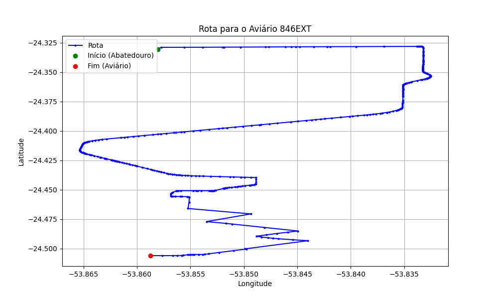

# Relatório de Rota - Aviário 846EXT

## Informações Gerais
- **Produtor:** LAR HUGO BATSCHKE 2319
- **Latitude:** -24.506394
- **Longitude:** -53.858764

## Dados da Rota
- **Distância Real:** 26.91 km
- **Tempo Estimado (OSRM):** 41.0 minutos
- **Tempo Estimado (40 km/h):** 40.4 minutos

## Mapa da Rota

[Visualizar Mapa Interativo](mapa_interativo.html)

## Rota até o aviário
1. Saia da rua sem nome, siga por 10m.
2. Vire à direita na Avenida Ariosvaldo Bitencourt, siga por 200m.
3. Siga em frente na Avenida Ariosvaldo Bitencourt, siga por 2,6 km.
4. Vire em frente na Rodovia Alberto Dalcanale, siga por 14,2 km.
5. Vire à direita na rua sem nome, siga por 4,3 km.
6. Vire à direita na rua sem nome, siga por 840m.
7. Vire à esquerda na rua sem nome, siga por 1,2 km.
8. Vire à direita na rua sem nome, siga por 630m.
9. Vire à esquerda na rua sem nome, siga por 660m.
10. Vire à direita na rua sem nome, siga por 970m.
11. Vire à esquerda na rua sem nome, siga por 20m.
12. Vire à direita na rua sem nome, siga por 1,2 km.
13. Você chegará ao aviário 846EXT à esquerda.
