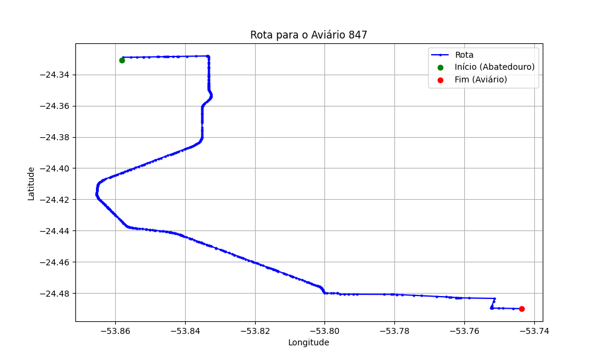

# Relatório de Rota - Aviário 847

## Informações Gerais
- **Produtor:** ODAIR PAULO MULLER
- **Latitude:** -24.489886
- **Longitude:** -53.743617

## Dados da Rota
- **Distância Real:** 30.41 km
- **Tempo Estimado (OSRM):** 38.6 minutos
- **Tempo Estimado (40 km/h):** 45.6 minutos

## Mapa da Rota

[Visualizar Mapa Interativo](mapa_interativo.html)

## Rota até o aviário
1. Saia da rua sem nome, siga por 10m.
2. Vire à direita na Avenida Ariosvaldo Bitencourt, siga por 200m.
3. Siga em frente na Avenida Ariosvaldo Bitencourt, siga por 2,6 km.
4. Vire em frente na Rodovia Alberto Dalcanale, siga por 21,0 km.
5. Vire à esquerda na rua sem nome, siga por 250m.
6. New name em frente na Rua Corbélia, siga por 230m.
7. Siga em frente na Rua Corbélia, siga por 490m.
8. New name em frente na rua sem nome, siga por 4,0 km.
9. End of road à direita na rua sem nome, siga por 680m.
10. Vire à esquerda na rua sem nome, siga por 900m.
11. Você chegará ao aviário 847 à esquerda.
