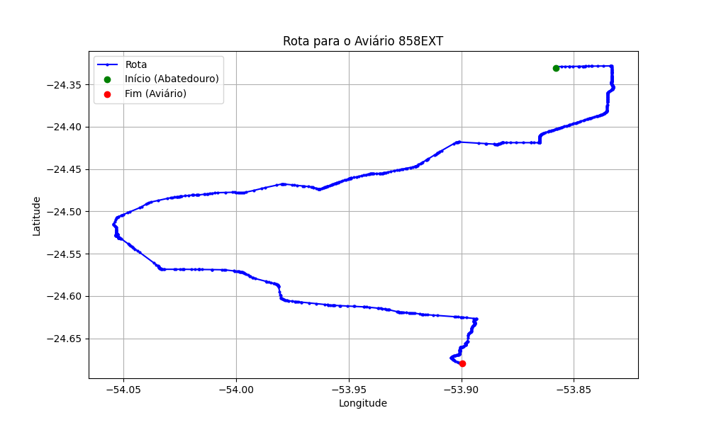

# Relatório de Rota - Aviário 858EXT

## Informações Gerais
- **Produtor:** LAR ILDO REUTER 1263
- **Latitude:** -24.679833
- **Longitude:** -53.899472

## Dados da Rota
- **Distância Real:** 68.73 km
- **Tempo Estimado (OSRM):** 72.8 minutos
- **Tempo Estimado (40 km/h):** 103.1 minutos

## Mapa da Rota

[Visualizar Mapa Interativo](mapa_interativo.html)

## Rota até o aviário
1. Saia da rua sem nome, siga por 10m.
2. Vire à direita na Avenida Ariosvaldo Bitencourt, siga por 200m.
3. Siga em frente na Avenida Ariosvaldo Bitencourt, siga por 2,6 km.
4. Vire em frente na Rodovia Alberto Dalcanale, siga por 11,1 km.
5. Siga em frente na rua sem nome, siga por 60m.
6. Vire levemente à direita na rua sem nome, siga por 2,0 km.
7. Vire em frente na rua sem nome, siga por 1,8 km.
8. Vire em frente na rua sem nome, siga por 10,9 km.
9. Vire em frente na rua sem nome, siga por 11,5 km.
10. Roundabout à direita na rua sem nome, siga por 30m.
11. Exit roundabout em frente na rua sem nome, siga por 60m.
12. Roundabout em frente na Avenida Maripa, siga por 40m.
13. Exit roundabout em frente na Avenida Maripa, siga por 290m.
14. Roundabout levemente à direita na Avenida Maripá, siga por 50m.
15. Exit roundabout levemente à direita na Avenida Maripá, siga por 170m.
16. Siga em frente na rua sem nome, siga por 21,5 km.
17. Vire à direita na rua sem nome, siga por 6,4 km.
18. Vire à esquerda na rua sem nome, siga por 70m.
19. Você chegará ao aviário 858EXT à direita.
