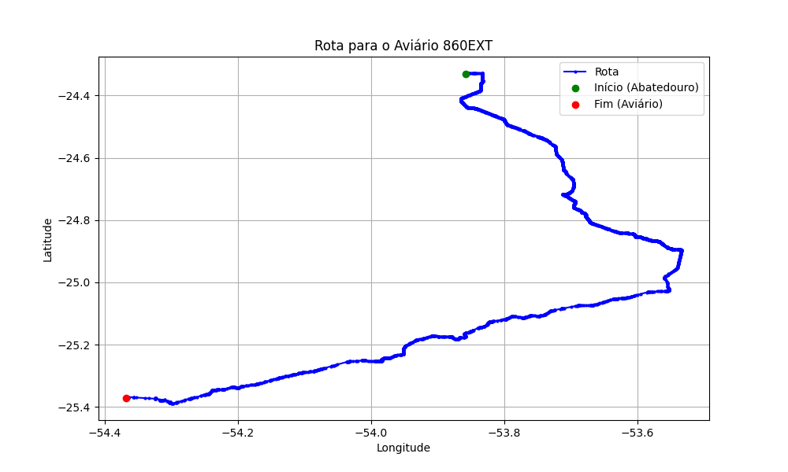

# Relatório de Rota - Aviário 860EXT

## Informações Gerais
- **Produtor:** LAR ILDO REUTER 1265
- **Latitude:** -25.372972
- **Longitude:** -54.367722

## Dados da Rota
- **Distância Real:** 201.12 km
- **Tempo Estimado (OSRM):** 179.6 minutos
- **Tempo Estimado (40 km/h):** 301.7 minutos

## Mapa da Rota

[Visualizar Mapa Interativo](mapa_interativo.html)

## Rota até o aviário
1. Saia da rua sem nome, siga por 10m.
2. Vire à direita na Avenida Ariosvaldo Bitencourt, siga por 200m.
3. Siga em frente na Avenida Ariosvaldo Bitencourt, siga por 2,6 km.
4. Vire em frente na Rodovia Alberto Dalcanale, siga por 51,7 km.
5. Siga em frente na rua sem nome, siga por 230m.
6. Siga em frente na Rodovia Perimetral Norte, siga por 90m.
7. New name em frente na Rodovia José Neves Formighieri, siga por 29,3 km.
8. Off ramp levemente à direita na rua sem nome, siga por 14,5 km.
9. Off ramp levemente à direita na rua sem nome, siga por 550m.
10. Siga em frente na rua sem nome, siga por 93,3 km.
11. Vire à direita na rua sem nome, siga por 500m.
12. Vire levemente à esquerda na rua sem nome, siga por 180m.
13. Vire levemente à direita na rua sem nome, siga por 1,2 km.
14. Vire à esquerda na rua sem nome, siga por 1,8 km.
15. Vire levemente à esquerda na rua sem nome, siga por 4,3 km.
16. Vire à esquerda na rua sem nome, siga por 640m.
17. Você chegará ao aviário 860EXT à esquerda.
