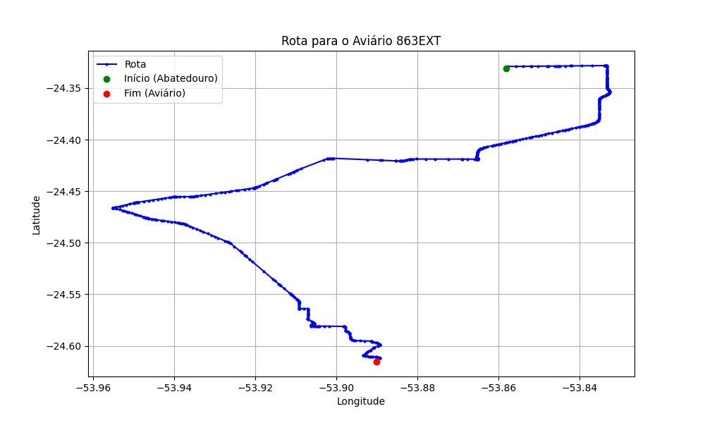

# Relatório de Rota - Aviário 863EXT

## Informações Gerais
- **Produtor:** LAR GABRIEL FRITZEN 1510
- **Latitude:** -24.616138
- **Longitude:** -53.887666

## Dados da Rota
- **Distância Real:** 45.60 km
- **Tempo Estimado (OSRM):** 56.6 minutos
- **Tempo Estimado (40 km/h):** 68.4 minutos

## Mapa da Rota

[Visualizar Mapa Interativo](mapa_interativo.html)

## Rota até o aviário
1. Saia da rua sem nome, siga por 10m.
2. Vire à direita na Avenida Ariosvaldo Bitencourt, siga por 200m.
3. Siga em frente na Avenida Ariosvaldo Bitencourt, siga por 2,6 km.
4. Vire em frente na Rodovia Alberto Dalcanale, siga por 11,1 km.
5. Siga em frente na rua sem nome, siga por 60m.
6. Vire levemente à direita na rua sem nome, siga por 2,0 km.
7. Vire em frente na rua sem nome, siga por 1,8 km.
8. Vire em frente na rua sem nome, siga por 8,0 km.
9. Vire à esquerda na rua sem nome, siga por 20m.
10. Vire à direita na Avenida Horizontina, siga por 1,2 km.
11. New name em frente na Rodovia Prefeito Daniel Wutzke, siga por 10,9 km.
12. Vire à esquerda na Avenida Marechal Castelo Branco, siga por 240m.
13. Vire à direita na Rua Salvador, siga por 2,0 km.
14. Vire à esquerda na Linha São João, siga por 2,4 km.
15. Siga em frente na Linha São João, siga por 3,1 km.
16. Você chegará ao aviário 863EXT à esquerda.
