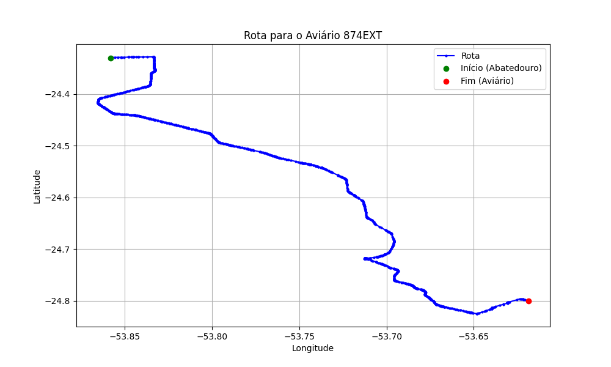

# Relatório de Rota - Aviário 874EXT

## Informações Gerais
- **Produtor:** LAR TATIANE KESIA KAMEI BESAGIO 1571
- **Latitude:** -24.799922
- **Longitude:** -53.61833

## Dados da Rota
- **Distância Real:** 73.93 km
- **Tempo Estimado (OSRM):** 66.9 minutos
- **Tempo Estimado (40 km/h):** 110.9 minutos

## Mapa da Rota

[Visualizar Mapa Interativo](mapa_interativo.html)

## Rota até o aviário
1. Saia da rua sem nome, siga por 10m.
2. Vire à direita na Avenida Ariosvaldo Bitencourt, siga por 200m.
3. Siga em frente na Avenida Ariosvaldo Bitencourt, siga por 2,6 km.
4. Vire em frente na Rodovia Alberto Dalcanale, siga por 51,7 km.
5. Siga em frente na rua sem nome, siga por 230m.
6. Siga em frente na Rodovia Perimetral Norte, siga por 90m.
7. New name em frente na Rodovia José Neves Formighieri, siga por 13,7 km.
8. Off ramp levemente à esquerda na rua sem nome, siga por 170m.
9. End of road à direita na Marginal BR 467, siga por 470m.
10. Vire à esquerda na Rua Ernesto Luiz Pizzato, siga por 210m.
11. New name em frente na Estrada Linha Sede Alvorada, siga por 2,8 km.
12. Siga em frente na Estrada Linha Sede Alvorada, siga por 1,1 km.
13. Vire à direita na rua sem nome, siga por 680m.
14. Você chegará ao aviário 874EXT à esquerda.
