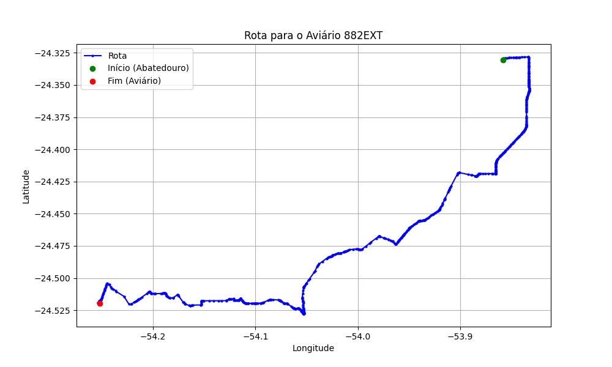

# Relatório de Rota - Aviário 882EXT

## Informações Gerais
- **Produtor:** LAR VILMAR FULBER 2416
- **Latitude:** -24.519247
- **Longitude:** -54.251883

## Dados da Rota
- **Distância Real:** 64.52 km
- **Tempo Estimado (OSRM):** 72.8 minutos
- **Tempo Estimado (40 km/h):** 96.8 minutos

## Mapa da Rota

[Visualizar Mapa Interativo](mapa_interativo.html)

## Rota até o aviário
1. Saia da rua sem nome, siga por 10m.
2. Vire à direita na Avenida Ariosvaldo Bitencourt, siga por 200m.
3. Siga em frente na Avenida Ariosvaldo Bitencourt, siga por 2,6 km.
4. Vire em frente na Rodovia Alberto Dalcanale, siga por 11,1 km.
5. Siga em frente na rua sem nome, siga por 60m.
6. Vire levemente à direita na rua sem nome, siga por 2,0 km.
7. Vire em frente na rua sem nome, siga por 1,8 km.
8. Vire em frente na rua sem nome, siga por 10,9 km.
9. Vire em frente na rua sem nome, siga por 11,5 km.
10. Roundabout à direita na rua sem nome, siga por 10m.
11. Exit roundabout levemente à direita na rua sem nome, siga por 300m.
12. Siga em frente na rua sem nome, siga por 6,5 km.
13. Vire à esquerda na Rua Anhanguera, siga por 750m.
14. End of road à direita na Rua Ipê, siga por 120m.
15. Vire à esquerda na Rodovia Municipal Ernesto Seifert Filho, siga por 3,6 km.
16. Siga em frente na Rodovia Municipal Ernesto Seifert Filho, siga por 6,9 km.
17. New name em frente na Avenida Senador Souza Naves, siga por 1,0 km.
18. Vire levemente à direita na rua sem nome, siga por 3,1 km.
19. Vire à esquerda na rua sem nome, siga por 1,9 km.
20. Vire acentuadamente à esquerda na rua sem nome, siga por 180m.
21. Você chegará ao aviário 882EXT à esquerda.
