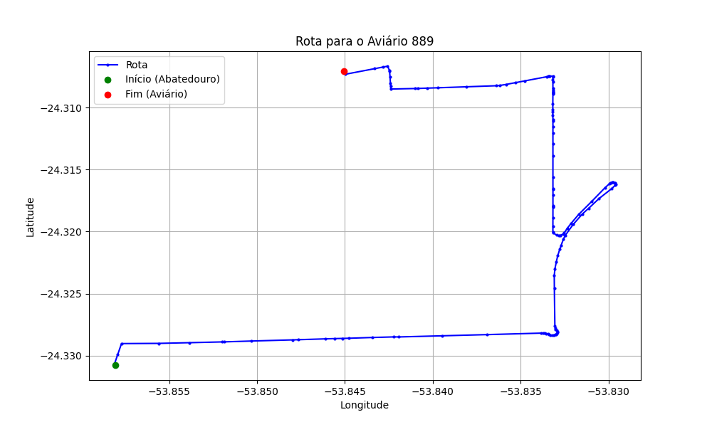

# Relatório de Rota - Aviário 889

## Informações Gerais
- **Produtor:** DORVALINO PASTORE
- **Latitude:** -24.3055
- **Longitude:** -53.847

## Dados da Rota
- **Distância Real:** 7.64 km
- **Tempo Estimado (OSRM):** 11.5 minutos
- **Tempo Estimado (40 km/h):** 11.5 minutos

## Mapa da Rota

[Visualizar Mapa Interativo](mapa_interativo.html)

## Rota até o aviário
1. Saia da rua sem nome, siga por 10m.
2. Vire à direita na Avenida Ariosvaldo Bitencourt, siga por 200m.
3. Siga em frente na Avenida Ariosvaldo Bitencourt, siga por 2,5 km.
4. Vire à esquerda na rua sem nome, siga por 1,5 km.
5. Vire levemente à esquerda na rua sem nome, siga por 660m.
6. Vire em frente na Rodovia Alberto Dalcanale, siga por 1,4 km.
7. Vire à esquerda na rua sem nome, siga por 40m.
8. New name em frente na Rua João Dazzi, siga por 310m.
9. New name em frente na Rua Attílio Berno, siga por 610m.
10. End of road à direita na Rua Curina Galli, siga por 210m.
11. Vire à esquerda na Rua Luiz Melodia, siga por 260m.
12. End of road à direita na Rua Mário Reis, siga por 30m.
13. Você chegará ao aviário 889.
